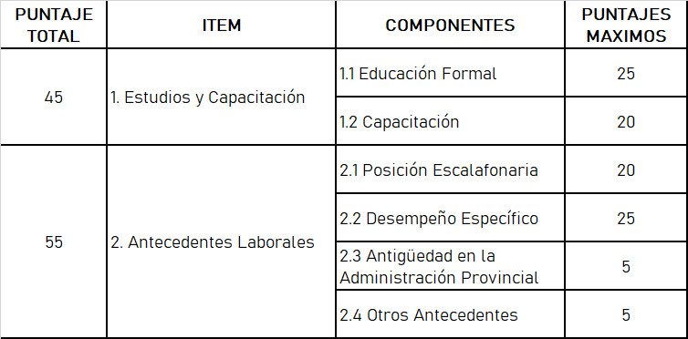
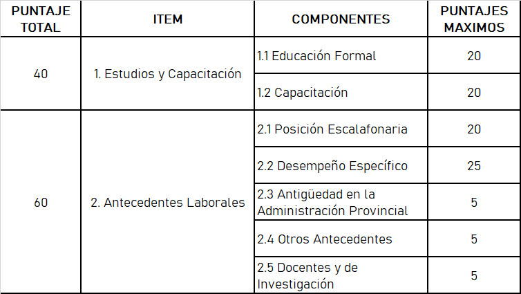
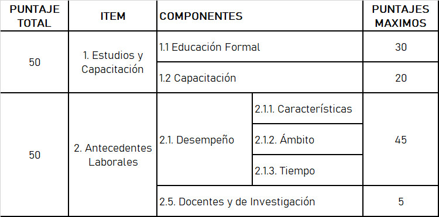
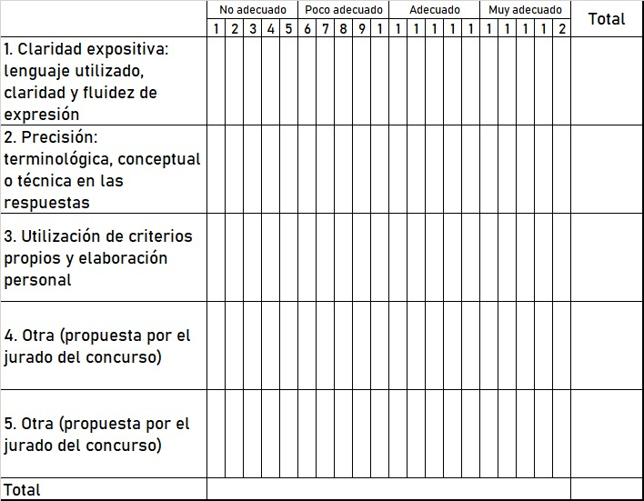

# ANEXO A | Estatuto Escalafón para el personal de la Administración Provincial de Impuestos

## **CAPÍTULO I - AMBITO DE APLICACIÓN**

**ARTÍCULO 1°**.- El presente estatuto comprende a todos los agentes que presten servicios en la Administración Provincial de Impuestos de la Provincia de Santa Fe (A.P.I.), según la clasificación que de ellos se practique en el mismo, así como a los que en el fututo se incorporen. El cumplimiento integral del estatuto es obligatorio y se aplicará a todos sus efectos a partir de su vigencia.

Se exceptúa del presente régimen a los cargos de Administrador Provincial de Impuestos y a los Administradores Regionales respectivos.

## CAPÍTULO II - CLASIFICACIÓN DEL PERSONAL

**ARTÍCULO 2°**.- Todos los nombramientos de personal comprendidos en el presente Estatuto revisten en carácter de permanente, salvo que expresamente se señale lo contrario en el acto de designación.

**ARTÍCULO 3°**.- Todo nombramiento de carácter permanente origina la incorporación del agente a la carrera, la cual está dada por el progreso del mismo dentro de los niveles escalafonarios.

**ARTÍCULO 4°**.- El personal no permanente comprende al personal contratado, o para aquel cuya relación laboral está regida por un contrato a plazo determinado, y presta servicios en forma personal y directa.

Este personal se empleará únicamente para la realización de trabajos que, por su naturaleza o transitoriedad, no pueden ser realizados por el personal permanente.

Las designaciones no pueden exceder del lapso de doce (12) meses.

## CAPÍTULO III - INGRESO

**ARTÍCULO 5°**.- Salvo los casos previstos en el párrafo segundo del artículo 2° del Régimen Laboral establecido por el artículo 1° de la Ley N° 10.813, los nombramientos de personal permanente sólo adquirirán tal carácter una vez cumplido doce (12) meses de servicio efectivo.

Durante tal período la designación podrá ser revocada en cualquier momento por la autoridad que la dispuso, no obstante haber aprobado el examen de competencia o requisito de admisión.\
El ingresante quedará confirmado automáticamente una vez satisfechas las siguientes condiciones:

a)   Cumplir el período de doce (12) meses de servicio efectivo en la Administración Provincial de Impuestos.

b)   Obtener la certificación definitiva de aptitud psicofísica para la función o cargo, expedida por autoridad médica competente.

c)   Obtener la calificación de idoneidad que exija la Administración Provincial de Impuestos.

La calificación o pedido de revocación del nombramiento mencionado precedentemente son responsabilidad de los Administradores Regionales, quienes elevarán al Administrador Provincial la evaluación efectuada, treinta (30) días corridos antes de la expiración del plazo previsto en el primer párrafo del presente. Los citados funcionarios serán solidariamente responsables por el incumplimiento de lo aquí dispuesto, inobservancia que será considerada falta grave.

**ARTÍCULO 6°**.- A la Administración Provincial de Impuestos se ingresa por el nivel y grado, que para cada caso se indica en el artículo 20°, salvo que deban cubrirse puestos superiores o de supervisión.

Son requisitos indispensables para el ingreso:

a)  Someterse al procedimiento de selección que acredite la idoneidad para el desempeño de la función.

b)   Poseer condiciones morales y de conducta intachables.

c)   Tener entre 18 (dieciocho) y 50 (cincuenta) años de edad.

d)   Poseer aptitudes psicofísicas para la función a la cual aspira.

e)   Ser argentino nativo o naturalizado.

1\.  El límite de edad previsto en el inciso "C" de este artículo puede extenderse hasta la edad mínima establecida para obtener la jubilación ordinaria exclusivamente en los tramos de personal superior cuando los conocimientos exigidos requieran el concurso de personal de especial aptitud técnica.

2\.   El ingreso a la A.P.I. no estará limitado por razones de sexo.

3\.  La A.P.I. admitirá cubrir las vacantes con hasta el 4% (cuatro por ciento) de los trabajadores disminuidos físicamente pero aptos para desempeñar eficazmente el puesto a cubrir.

**ARTÍCULO 7°**.- Aptitud psicofísica.

La condición psicofísica se calificará de la siguiente forma:

a)   Apto absoluto: cuando se reúnen las condiciones exigidas.

b)  Apto negativo: cuando no se reúnen la totalidad de las condiciones exigidas. En este caso el agente no puede ejercer derechos fundados en las causas que impidieron calificarlo apto absoluto o en sus consecuencias.

c)  Apto condicional: cuando no pueda completarse el examen médico por las características del caso o surja la ineptitud total para el ingreso y estas circunstancias puedan modificarse, se cumplirá un nuevo examen transcurridos 180 (ciento ochenta) días. En este caso, el plazo establecido en el artículo 5° se prorrogará por un período de igual duración.

d)  Inepto: Cuando del examen médico surja la inhabilitación total para el ingreso. La calificación de inepto en el primer examen o en el posterior, dispuesto conforme al inciso "c", es causal de revocación de la designación.

**ARTÍCULO 8°**.- Sin perjuicio de lo establecido en el artículo 6°, no podrán ingresar a la A.P.I.:

a)   El condenado por delito doloso y hasta después de dos (2) años de haber cumplido su condena.

b)   El condenado por delito en perjuicio de la Administración Pública.

c)   El fallido o concursado civilmente hasta que obtuviere la rehabilitación.

d)   El que tenga pendiente proceso criminal.

e)   El exonerado en la Administración Pública Nacional, Provincial o Municipal.

f)  El que se encuentre en situación de incompatibilidad a partir de su nombramiento.

g)  El que esté inhabilitado para el ejercicio de cargos públicos, durante el término de su inhabilitación.

h)   El que se encuentra en infracción a los deberes relativos al empadronamiento, enrolamiento o servicio militar.

i)  El que padezca enfermedad infecto contagiosa.

j)  El deudor moroso del Fisco por sentencia judicial mientras no haya regularizado su situación.

k)   El que estuviera percibiendo algún tipo de jubilación.

**ARTÍCULO 9°**.- Los agentes designados en violación a lo dispuesto en el artículo anterior podrán ser dejados cesantes previo sumario, cualquiera sea el tiempo transcurrido sin perjuicio de la validez de los actos y de las presentaciones cumplidas durante el ejercicio de las funciones. Será competencia para declarar la cesantía la autoridad que dispuso el nombramiento.

## CAPÍTULO IV - DERECHOS DEL PERSONAL

**ARTÍCULO 10°**.- El personal permanente gozará los derechos de:

a)   Estabilidad en los términos del artículo 8° de la Ley N° 10813.

b)   Escalafón y retribución justa.

c)   Compensaciones, subsidios e indemnizaciones.

d)   Menciones y premios.

e)   Igualdad de oportunidades en la carrera.

f)  Capacitación.

g)   Licencias, justificaciones y franquicias.

h)   Asociación y/o libre agremiación.

i)  Asistencia social del agente y sus familias.

j)  Traslados y permutas.

k)   Reingreso.

l)  Renuncia al cargo.

ll) Permanencia y beneficios para jubilación y retiro.

m)  Interponer recursos.

**ARTÍCULO 11°**.- Estabilidad es el derecho del agente a conservar el empleo, en el nivel escalafonario alcanzado y la inmovilidad en la residencia siempre que el servicio lo consienta.

Se adquiere una vez producido el nombramiento definitivo y se mantiene hasta alcanzar una edad superior en dos (2) años a la exigida para la jubilación ordinaria o antes de esa edad, si reúne los requisitos para obtener ese beneficio.

El personal amparado por la estabilidad retiene asimismo el empleo cuando es designado en el orden provincial para cumplir funciones sin garantías de estabilidad.

**ARTÍCULO 12°**.- La estabilidad se perderá:

a)   Por las causas previstas en el régimen disciplinario;

b)  Por las causales que se mencionan en los incisos a) y b) del artículo 8° del presente régimen, sobrevivientes a sus designación, excepto las establecidas en los incisos f) y h), las que serán procedentes si el agente no regulariza su situación luego de intimado a hacerlo;

c)   Por acogerse a la jubilación o retiro voluntario;

**ARTÍCULO 13°**.- La carrera escalafonaria es el progreso del agente en el agrupamiento en que revista, o en los que pueda revistar como consecuencia de cambio de agrupamiento, producido de acuerdo con las normas previstas en el Capítulo V.

Los agrupamientos se dividen en niveles y grados que determinan la posición Escalafonaria que puede ir alcanzando el agente.

**ARTÍCULO 14°**.- El pase de un grado a otro superior del mismo u otro nivel dentro del agrupamiento tendrá lugar cuando se hubieren alcanzado las condiciones que se determinan en los capítulos respectivos.

**ARTÍCULO 15°**.- Las promociones de carácter automático previstas en los diferentes agrupamientos se concretarán, en todos los casos y para todo el personal comprendido, el día 1° de enero siguiente a aquél en que cumplan los requisitos establecidos.

**ARTÍCULO 16°**.- Producida una vacante en el tramo de promoción automática de cualquiera de los agrupamientos previstos en el presente régimen, el cargo presupuestario de la vacante se transformará automáticamente en la categoría de ingreso prevista para cada uno de los agrupamientos o tramos de los mismos.

## CAPÍTULO V - AGRUPAMIENTOS Y CARRERA

**ARTÍCULO 17°**.- Los trabajadores de la A.P.I. estarán comprendidos, de acuerdo a la naturaleza de sus funciones, en dos agrupamientos:

a)   Técnico-administrativo.

b)   Servicio y mantenimiento.

**ARTÍCULO 18°**.- El personal que preste servicios administrativos, técnicos, de asesoramiento, de verificación -externa e interna- e inspección, comprendido en cada caso desde funciones elementales o auxiliares hasta las de planeamiento, control y dirección, estará incluido en el Agrupamiento Técnico-administrativo, el que abarcará los niveles A y B -con tres grados cada uno- y los C, D, E, F y G -con cinco grados cada uno-, según el detalle siguiente:

a)   Tramo Conducción: Desde el Nivel C - Grado 2 a Nivel A - Grado 3.

b)   Tramo Operativo: Desde el Nivel G - Grado 1 a Nivel C - Grado 1.

c)  Tramo Profesional: Nivel C - Grados 1 a 5. Se incluirá en este tramo a los agentes que desarrollen tareas de asesoramiento, investigación y cobro judicial, así como de análisis y programación de sistemas informáticos.

**ARTÍCULO 19°**.- Los agentes que realicen tareas de mantenimiento, talleres, conservación de instalaciones, limpieza, reparaciones, vigilancia y otras de similar naturaleza, así como la de conducción de vehículos, sean de Tramo Operativo o del de Conducción, revistarán en el Agrupamiento Servicio y Mantenimiento, y estarán incluidos en los Niveles G a C, con cinco grados cada uno a excepción del D que tendrá solo los grados 1 a 4 destinados a este Agrupamiento, y el Nivel C que comprenderá solo el Grado 2 según el siguiente detalle:

a)   Tramo Conducción: Nivel C - Grado 2.

b)   Tramo Operativo: desde el Nivel G - Grado 1 a Nivel D - Grado 4.

**ARTÍCULO 20°**.- El ingreso a los tramos operativos de cada uno de los Agrupamientos se hará por el procedimiento de selección que determine el Administrador Provincial de Impuestos, excepto para cubrir cargos de Inspector C y Operadores en que mediarán -en todos los casos- concursos, debiendo añadirse a los requisitos generales de ingreso los siguientes:

a)   Agrupamiento Técnico-administrativo: tener aprobado el ciclo secundario, excepto en el tramo Profesional que requerirá el título habilitante respectivo.

b)   Agrupamiento Servicios y Mantenimiento: tener aprobado el ciclo de enseñanza primaria.

El ingreso a los tramos operativos se hará por los Niveles y Grados que a continuación se indican:

a)   Agrupamiento técnico-administrativo: Nivel G - Grado 1, a excepción del personal que integrará el tramo Profesional, que lo hará por el Nivel C - Grado 1.

b)   Agrupamiento servicios y mantenimiento: Nivel G - Grado 1.

**ARTÍCULO 21°**.- El ingreso en el tramo de conducción se hará por el procedimiento de concursos - abiertos o internos- según determine el Administrador Provincial, siendo requisitos particulares, ade- más de los señalados en el artículo 6° del presente, reunir las condiciones que para cada función se establezcan en oportunidad del respectivo llamado a concurso.

**ARTÍCULO 22°**.- La promoción de los agentes dentro de los respectivos agrupamientos se producirá cuando se cumplan las condiciones y en las oportunidades que a continuación se consignan:

a)   Tramos Operativos: La promoción será automática y en razón del mero transcurso del tiempo   de prestación de servicios, según artículo 93° del presente excepto para los agentes que cumplan funciones de inspección en que la promoción se efectuará tomando en cuenta la evaluación de su desempeño en las condiciones que determine la reglamentación que al respecto se dicte.

b)   Tramos de Conducción: La promoción se hará mediante concurso de antecedentes y, en su caso, de oposición.

c)   Tramo Profesional: la promoción del cargo de Profesional E al de Profesional D será automático transcurridos dos (2) años, debiendo mediar concurso para acceder al cargo de Profesional A, B, o C.

**ARTÍCULO 23°**.- El personal tiene derecho a la retribución de sus haberes conforme a su ubicación en el respectivo escalafón o régimen que corresponda al carácter de su empleo. Para gozar de este derecho es indispensable:

a)   Que medie nombramiento con arreglo a las disposiciones del presente Régimen Jurídico.

b)  Que el agente haya prestado servicios, o esté comprendido en el Régimen de Licencias, Franquicias y Justificaciones, en todos los casos en que las mismas sean pagas.

**ARTÍCULO 24°**.- Compensaciones, subsidios e indemnizaciones:

El agente tiene derecho a la percepción de compensaciones y reintegros en concepto de viáticos, movilidad, servicios extraordinarios, gastos de comida, casa-habitación y similares, órdenes de pasaje y carga, en los casos y condiciones que se determinen.

Otras indemnizaciones, compensaciones y reintegros:

Debe pagarse indemnización, compensación o reintegro, según corresponda, por las siguientes causas:

a) Cesantía por incapacidad sobreviniente a la incorporación al servicio como personal permanente:

Cuando el empleado fuera dejado cesante por incapacidad permanente (absoluta o parcial) para cumplir sus tareas habituales a causa de enfermedad o accidente inculpable, debe percibir una indemnización igual a la mitad de un mes de su sueldo por cada año de servicio o fracción mayor a tres meses, tomando como base la mejor remuneración mensual y habitual percibida durante el último año o durante el plazo de prestación de servicio, actualizada al último mes inmediato anterior al pago de la indemnización.

El importe de esta indemnización no puede ser inferior a cinco meses de sueldo básico del cargo de Jefe de Sección, Nivel C Grado2, coeficiente 2,40A, ni superior a quince meses de sueldo del nivel escalafonario precedentemente citado.

Para tener derecho a esta indemnización se requiere que: a) la incapacidad sea sobreviniente al ingreso como personal permanente; b) la incapacidad haya sido declarada por la autoridad competente; c) el agente no esté en condiciones de percibir la indemnización de la ley de accidentes de trabajo; d) el agente no esté en condiciones de obtener un beneficio jubilatorio.

b) Accidente de trabajo o enfermedad profesional:

El personal tiene derecho a las indemnizaciones establecidas por la Ley de accidentes de trabajo.

c) Fallecimiento:

En caso de fallecimiento del empleado, tienen derecho a una indemnización igual a la prevista en el inciso a) del presente:

a) La cónyuge con derecho a alimentos o el cónyuge incapacitado totalmente, cuando su único sustento provenía del ingreso de la empleada.

b) Los hijos menores. La indemnización se distribuirá entre los beneficiarios como si fuera un bien ganancial, y no se abonará cuando sea procedente el pago de la indemnización por accidente de trabajo.

El importe de esta indemnización no puede ser inferior a diez meses de sueldo básico del cargo de Jefe de Sección, Nivel C Grado2, coeficiente 2,40A, ni superior a treinta meses de sueldo del nivel escalafonario precedentemente citado.

El plazo para la liquidación y pago de esta indemnización no debe exceder de treinta días corridos contados desde que se formuló la solicitud con cumplimiento de los requisitos necesarios. El trámite es sumario y preferencial. El incumplimiento es falta grave.

d) Reintegro de gastos de sepelio:

Quien se ha hecho cargo de los gastos de sepelio del agente fallecido tiene derecho al reintegro de aquéllos hasta un máximo del cincuenta por ciento de la remuneración mensual correspondiente al cargo de mayor jerarquía del escalafón.

e) Daños originados en o por actos de servicios;

f) Desarraigo;

g) Traslado.

Modificado por [Decreto Nº 4439/15 - Anexo D](../../decreto-no-2.695-83/decreto-no-4439-15/anexo-d-decretos-4447-92-y-0201-95.md)

**ARTÍCULO 25°**.- Daños originados en actos de servicios:

El agente que como consecuencia del servicio sufra un daño patrimonial, tiene derecho a una indemnización por el perjuicio causado siempre que no medie culpabilidad de su parte.

**ARTÍCULO 26°**.- Desarraigo.

El agente trasladado por razones de servicio y con carácter permanente a un lugar fuera de su domi- cilio, tiene derecho a compensación por desarraigo, en los términos del artículo 95°.

**ARTÍCULO 27°**.- Reintegro por traslado:

a) Traslado por enfermedad: El agente en comisión de servicio que contraiga una enfermedad que por su naturaleza haga necesario su traslado al lugar de su domicilio, tiene derecho al reintegro del gasto que le demande su retorno.

b) Traslado de restos mortales: Quien se ha hecho cargo del traslado de los restos del agente fallecido en el desempeño de una comisión de servicio y fuera del asiento habitual, tiene derecho al reintegro del gasto que demandó el traslado hasta el lugar donde indiquen los deudos dentro del territorio provincial.

Si el fallecimiento se produce cumpliendo funciones consecuentes de un traslado con carácter no permanente que no haya sido dispuesto a pedido del empleado, deben otorgarse sin cargo órdenes oficiales de pasaje para el retorno a su domicilio a los familiares que hayan estado a cargo del extinto y órdenes de carga para el transporte de muebles y enseres.

Modificado por [Decreto Nº 4439/15 - Anexo D](../../decreto-no-2.695-83/decreto-no-4439-15/anexo-d-decretos-4447-92-y-0201-95.md)

**ARTÍCULO 28°** - Menciones y premios.

El personal tendrá derecho a menciones especiales cuando hubiere realizado alguna labor o acto de mérito extraordinario que se traduzca en un beneficio para los intereses del Estado, conforme lo determine la reglamentación.

**ARTÍCULO 29°**.- Igualdad de oportunidades.

El personal permanente tiene derecho a igualdad de oportunidades para optar a cubrir cada uno de los niveles y jerarquías previstas en el escalafón. Este derecho se conservará aún cuando el personal circunstancialmente no preste servicios en forma efectiva, en virtud de encontrarse en uso de cualquiera de las licencias previstas, con excepción de las acordadas sin goce de sueldo por razones particulares.

**ARTÍCULO 30°**.- Capacitación.

La capacitación deberá constituir un sistema que facilite la adaptación de los recursos humanos a las necesidades de estructura organizativa y a los cambios tecnológicos brindando, asimismo, la oportunidad a los agentes de perfeccionar sus capacidades personales.

**ARTÍCULO 31°**.- El derecho a la capacitación está dado por:

a) La participación en cursos de perfeccionamiento dictados con el propósito de mejorar la eficiencia en el Organismo;

b) El otorgamiento de licencias para iniciar o completar estudios en los diversos niveles de la enseñanza; y

c) El acceso a la adjudicación de becas de perfeccionamiento.

A los efectos previstos en los incisos a) y c), la Administración Provincial de Impuestos aprobará los requisitos que deberán reunir los aspirantes, salvo en el supuesto de becas en cuyas bases ya estuvieran establecidos.

Queda entendido que la capacitación será un deber y no un derecho de los trabajadores, atento a que la idoneidad constituye una condición fundamental de toda promoción.

**ARTÍCULO 32°**.- Derecho de asociación

Los trabajadores tienen derecho a asociarse, de acuerdo a las normas vigentes, los principios consagrados por la Constitución Nacional, Provincial y los Convenios Internacionales.

**ARTÍCULO 33°**.- Asistencia social del agente y su familia

La Administración Provincial de Impuestos propenderá a la prestación de servicios sociales a trabajadores, asegurando la asistencia social del mismo y de su núcleo familiar.

**ARTÍCULO 34°**.- Traslados y permutas

TRASLADOS: Puede disponerse el traslado de los agentes a su pedido, dentro del ámbito de este Estatuto, en cargos de igual nivel y jerarquía, siempre que las necesidades del servicio lo permitan y cuando existan razones que resulten atendibles a juicio de la autoridad competente.

PERMUTAS: Pueden permutarse cargos siempre que no se afecte el servicio.

Los agentes deben revistar en el mismo nivel y grado y tener funciones equivalentes.

No se autorizan permutas si uno de ambos agentes están en condiciones de obtener la jubilación ordinaria.

**ARTÍCULO 35°**.- Reingreso

Todo ex-agente de la Administración Provincial de Impuestos podrá solicitar su reingreso a la misma, siempre que no hubiese dejado de pertenecer al Organismo por aplicación de los artículos 45° y 46° del presente Estatuto.

**ARTÍCULO 36°**.- Renuncia al cargo

La renuncia del agente produce su baja una vez notificada su aceptación o transcurrido el plazo de TREINTA (30) días, salvo que con anterioridad al vencimiento de dicho término se haya dispuesto a su respecto la instrucción de procedimiento disciplinario.

**ARTÍCULO 37°**.- Permanencia y beneficios para jubilación y retiro.

Podrá permanecer prestando servicios el trabajador en condiciones de jubilarse, salvo que la Administración Provincial de Impuestos requiera, en forma explicita, la iniciación de los trámites del mencionado beneficio.

En ningún caso dejará de percibir sus haberes, hasta tanto se le acuerde el beneficio jubilatorio.

**ARTÍCULO 38°**.- Recursos

Tendrán derechos los trabajadores al procedimiento recursivo que les acuerdan el presente Régimen Jurídico y el Decreto 10.204/58, en la medida en que tengan un interés legítimo o se les haya vulnerado algún derecho.

**ARTÍCULO 39°**.- Ropa de trabajo

El trabajador contemplado en el artículo 98° tendrá derecho a que le sea provista la ropa y elementos de trabajo por parte de la Administración Provincial de Impuestos.

__[_**Decreto Nº 0967/12**_](https://drive.google.com/file/d/1cER15Tno3rweEG0goWHCELcRtIuUH3HM/view?usp=sharing)_** - ARTICULO 23º**: Extiéndase a los agentes pertenecientes a los Estatutos y Escalafones para el Personal de la Administración Provincial de Impuestos (Decreto N° 4447/92) y del Servicio de Catastro e Información Territorial (Decreto N° 201/95) lo dispuesto en el artículo 36º de la Ley 8525 para el caso de indemnización por fallecimiento del empleado._

## CAPÍTULO VI - DEBERES Y PROHIBICIONES

**ARTÍCULO 40°**.- Sin perjuicio de los deberes que particularmente imponen las leyes, decretos y resoluciones especiales, el personal está obligado a:

a) La prestación personal del servicio con eficiencia, capacidad y dedicación adecuada, en el lugar, condiciones de tiempo y forma que determine la Administración.

b) Observar con la debida diligencia, una conducta decorosa y leal y un comportamiento digno de la consideración, responsabilidad y confianza que a su carácter de servidor públicos exige.

c) Conducirse con tacto y cortesía en sus relaciones con el público, conducta que deberá observarse asimismo respecto de sus superiores, compañeros y subordinados.

d) Obedecer toda orden emanada de un superior jerárquico con atribuciones y competencia para charla, que reúna las formalidades del caso y tenga por objeto la realización de actos del servicio compatibles con las funciones del agente.

f) Declarar sus actividades a fin de dar cumplimiento al régimen de incompatibilidades establecidos en el presente régimen laboral.

g) Declarar bajo juramento su estado patrimonial y modificaciones ulteriores, en la forma y tiempo que fije la reglamentación respectiva, proporcionando los informes y documentación que al respecto se requiera.

h) Guardar secreto de todo asunto del servicio que deba permanecer en ese estado, en razón de su naturaleza o de instrucciones especiales, obligación que subsistirá aún después de cesar en sus funciones.

i) Encuadrarse en las disposiciones legales y reglamentarias vigentes sobre incompatibilidad y acumulación de cargos.

j) Excusarse de intervenir en todo trámite en que su actuación pueda originar interpretaciones de parcialidad, siempre y cuando la Administración Provincial de Impuestos apruebe la excusación.

k) Iniciar los trámites jubilatorios y, en su caso, el de reconocimientos de servicios por lo menos un año antes de alcanzar los requisitos mínimos exigidos para la jubilación ordinaria.

**ARTÍCULO 41°**.- Incompatibilidades Por resultar incompatibles con el servicio y sin perjuicio de lo establecido en leyes y reglamentos vigentes, queda prohibido al personal:

a) Prestar cualquier clase de asesoramiento en forma gratuita u onerosa en materia de gravámenes cuya verificación, fiscalización y percepción están a cargo de este Organismo, así como patrocinar o representar a contribuyentes o responsables ante el mismo, o intervenir, tramitar o gestionar actuaciones administrativas o judiciales vinculadas con los mencionados gravámenes, salvo que se trate de derecho propio, del cónyuge, ascendientes, descendientes o colaterales hasta el segundo grado inclusive.

Esta prohibición debe entenderse referida al asesoramiento efectuado en forma privada y no aquel en que el agente evacue la consulta en su carácter de empleado del Fisco y en cumplimiento de sus funciones.

b) Ejercer otro cargo público, excepto la docencia.

c) Explotar contratos, concesiones, franquicias o adjudicaciones celebradas u otorgadas por la Provincia al agente, su cónyuge y/o descendientes de primer grado.

d) Difundir por cualquier medio y sin la previa autorización superior, informes del Organismo y de la Administración Pública Provincial.

e) Realizar gestiones de personas ajenas a la Repartición, en forma gratuita u onerosa.

f) Realizar, propiciar o consentir actos incompatibles con las normas de moral, urbanidad y buenas costumbres.

g) Recibir homenajes, obsequios, importes de colectas en dinero o en especie con motivo de sus funciones.

h) Utilizar con fines particulares los elementos destinados al servicio oficial, y los servicios del personal a sus órdenes.

i) Utilizar con fines particulares los elementos de transporte y útiles de trabajo destinados al servicio oficial, y los servicios del personal a sus órdenes.

## CAPÍTULO VII - REGIMEN DISCIPLINARIO

ARTÍCULO 42°.- Sanciones

El personal puede ser pasible de las siguientes sanciones:

1\) Apercibimiento;

2\) Suspensión hasta 30 días corridos;

3\) Cesantía;

4\) Exoneración.

A una falta solo corresponde una sanción.

**ARTÍCULO 43°**.- Son causas para el apercibimiento, incumplir los siguientes deberes:

a) Prestar servicio en forma personal con eficiencia, capacidad y diligencia, en el lugar, condiciones de tiempo, forma y modalidad que determine la autoridad competente;

b) Observar en el servicio y fuera de él una conducta intachable y decorosa conforme a su cargo y función;

c) Conducirse con respecto, tacto y cortesía en su trato con el público, con sus superiores, compañeros y subordinados;

d) Obedecer toda orden emanada de su superior jerárquico con competencia para darla, que tenga por objeto la realización de actos de servicios, revista las formalidades del caso y sea compatible con las funciones;

e) Promover las acciones judiciales que correspondan cuando públicamente sea objeto de imputación delictuosa, pudiendo al efecto requerir el patrocinio legal gratuito del servicio jurídico del Organismo;

f) Cumplir íntegramente y en forma regular el horario de labor establecido;

g) Responder por la eficiencia y rendimiento del personal a sus órdenes;

h) Velar por la conservación de los bienes del Organismo;

i) Declarar la nómina de familiares a su cargo y comunicar, dentro del plazo de treinta días de producido, el cambio de estado civil o variantes de carácter familiar, acompañando en todos los casos la documentación correspondientes;

j) Someterse al examen psicofísico cuando lo disponga la autoridad competente.

**ARTÍCULO 44°**.- Son causas para la suspensión:

a) Reiteración de faltas que dieron lugar a la aplicación de apercibimiento, sin perjuicio de la aplicación directa de la suspensión cuando la gravedad de la causa así lo justifique.

b) Recibir dádivas, obsequios o recompensas con motivos o en ocasión del desempeño de sus funciones;

c) Revelar secretos o informaciones de los que tenga conocimiento con motivo o en ocasión del desempeño de sus funciones;

d) Encuadrarse en las disposiciones de incompatibilidad;

e) Quebramiento de las prohibiciones legalmente estatuidas;

f) Los supuestos en que el incumplimiento se califique como grave;

**ARTÍCULO 45°**.- Son causas para la cesantía:

a) Inasistencias injustificadas que excedan de diez días continuos o discontinuos en los doce meses inmediatos anteriores;

b) Incurrir en falta que de lugar a suspensión cuando el inculpado haya sufrido en los doce meses inmediatos anteriores, más de treinta días de suspensión;

c) Abandono del servicio sin causa justificada;

d) Faltas reiteradas en el cumplimiento de sus tareas;

e) Falta grave al superior durante el servicio;

f) Ser declarado en concurso civil o quiebra calificados de fraudulentos;

g) Quebrantamiento de las prohibiciones legalmente determinadas;

h) Delito doloso que por las circunstancias afecte al decoro con que debe ejercerse la función.

**ARTÍCULO 46°**.- Son causas para la exoneración:

a) Falta grave que perjudique material o moralmente a la Administración;

b) Delito contra o que cause perjuicio a la Administración;

c) Indignidad moral;

d) Incumplimiento intencional de órdenes legales.

e) Delito que no se refiera a la Administración cuando el hecho sea doloso y traiga aparejadas las sanciones accesorias previstas en el artículo del Código Penal.

**ARTÍCULO 47°**.- El Administrador Provincial y los Administradores Regionales pueden aplicar apercibimientos y suspensión no superior a cinco (5) días con un máximo de diez (10) días por año calendario.

En ningún caso se podrán aplicar suspensiones mayores a cinco (5) días sin sumario previo. Cuando la sanción no requiera sumario para su aplicación se deberá dar vista al agente por el término de tres (3) días para que efectúe su descargo.

**ARTÍCULO 48°**.- El sumario se iniciará de oficio o por denuncia escrita y debidamente ratificada, y su instrucción será ordenada inmediatamente de conocido el hecho por las autoridades que determine la Administración Provincial. En casos de denuncia, ésta deberá consignar una relación circunstanciada del hecho denunciado con expresión de tiempo, lugar, medios empleados y actuaciones administrativas en que constare, exigiéndose al denunciante que constituya domicilio. El denunciante deberá aportar, asimismo, los elementos de prueba correspondientes, si los tuviera.

**ARTÍCULO 49°**.- El Instructor sumariante será designado por la autoridad que disponga el sumario administrativo, de un listado compuesto por Abogados y Procuradores de la Repartición por orden de lista. Este listado deberá confeccionarse anualmente.

Se confeccionarán dos listados de Instructores, uno de la Región Santa Fe y otro de la Región Rosario, que atenderán sus respectivas causas. En aquellos hechos calificados como graves, o cuando las circunstancias así lo exigieren, el Administrador Provincial podrá designar Instructores de una Región diferente a la del o los agentes sumariados.

Los Instructores integrantes del listado, en caso de que las circunstancias lo requieran, podrán actuar con dedicación exclusiva, revistando en comisión mientras dure el sumario y hasta su finalización.

**ARTÍCULO 50°**.- El Administrador Provincial designará anualmente al funcionario encargado de dicho cuerpo de Instructores, quién tendrá como misión:

a) Informar a la autoridad facultada para instruir sumarios;

b) Proponer al Instructor sumariante de acuerdo al orden establecido;

c) Vigilar la observancia de los plazos para la sustanciación de las causas;

d) Hacer observar la formalidad y la obligatoriedad de las denuncias administrativas, policiales y/o judiciales;

e) Controlar la aplicación de las suspensiones preventivas al personal sumariado, cuidando que se cumplan estrictamente sus términos;

f) Controlar que se cumplan todas las formalidades procedimentales para la iniciación y sustanciación de los sumarios.

**ARTÍCULO 51°**.- El sumario tiene por objeto:

1\) Comprobar la existencia de hechos que den lugar a la sanción disciplinaria;

2\) Individualizar a los responsables;

3\) Establecer las causas agravantes o atenuantes de responsabilidad;

4\) Comprobar la extensión del daño y el perjuicio que haya sufrido la Administración.

El sumario debe iniciarse dentro de las 24 horas de comunicada la resolución del Instructor.

**ARTÍCULO 52°**.- El Instructor puede ser recusado con expresión de causa dentro de los cinco (5) días de conocida la designación de aquél.

Puede, asimismo, excusarse expresando las razones que fundan su solicitud, pero la sustanciación de ésta no exime al Instructor de cumplir con sus funciones hasta que se resuelva el pedido.

La instrucción es secreta durante los primeros quince días de su iniciación. No son secretas las diligencias que se consideren definitivas e irreproducibles. El plazo del secreto se amplía por todos los lapsos en que se sustancia la recusación o excusación del Instructor.

**ARTÍCULO 53°**.- La instrucción es secreta durante los primeros quince días de su iniciación. No son secretas las diligencias que se consideren definitivas e irreproducibles. El plazo del secreto se amplía por todo el lapso en que se sustancia la recusación o excusación del Instructor.

**ARTÍCULO 54°**.- Cuando lo crea oportuno y en todo caso una vez que cuente con los elementos de mérito necesarios, el instructor debe citar al imputado para recibirle declaración no jurada sobre los hechos que se le atribuyen.

Si el imputado no comparece el día de la citación o no justifica su inasistencia, se lo considera notificado de toda providencia desde la fecha de ésta, salvo la notificación de la resolución que recaiga en el sumario.

**ARTÍCULO 55°**.- El imputado tiene los siguientes derechos:

1\) Conocer los hechos y faltas que se le atribuyen;

2\) Dictar y leer por sí su declaración y firmar cada una de las hojas donde está instrumentada;

3\) Expresar lo que estime conveniente para su descargo;

4\) Designar Abogado defensor;

5\) Constituir domicilio especial.

Luego de establecida la identidad del imputado, el Instructor le hará conocer los derechos que establece este artículo, y que puede negarse a declarar dejando constancia de ello. La omisión de este requisito causa la nulidad del acto.

**ARTÍCULO 56°**.- El Instructor puede requerir directamente de los organismos públicos y entidades privadas los informes relacionados con la investigación.

**ARTÍCULO 57°**.- La Instrucción debe ser completada en el plazo de cuarenta y cinco días, prorrogable por la autoridad que la ordenó.

Cuando la estime concluida, una vez agregados los antecedentes administrativos y, en su caso, los judiciales del imputado, el Instructor le corre vista por diez días.

No debe correrse vista sin haberse cumplido con el artículo 54°.

**ARTÍCULO 58°**.- Con la constatación de la vista, el imputado puede ofrecer pruebas. El Instructor debe diligenciar la prueba, salvo la notoriamente improcedente o sobreabundante que se rechaza mediante resolución fundada, recurrible solo mediante revocatoria.

La prueba debe producirse dentro de los quince días desde que fue ordenada. El Instructor puede prorrogar el plazo por otro tanto, si los medios ofrecidos lo justifican.

**ARTÍCULO 59°**.- Transcurrido el plazo de la vista prescripta en el artículo 57 o, en su caso, vencido el término para producir la prueba, dentro de los cinco días siguientes el Instructor redactará las conclusiones en forma precisa, fundada, y tratando por separado y numeradamente los hechos punibles que resulten de las actuaciones, el encuadramiento, normativo de esos hechos con cita de las disposiciones aplicables, la participación que haya tenido el imputado y las circunstancias que agraven o atenúen la responsabilidad.

Cumplido el acto se da vista al imputado por cinco días para que formule su defensa.

**ARTÍCULO 60°**.- Vencido este plazo, el Instructor pasa las actuaciones a la Asesoría Jurídica para que en el término de tres días dictamine separada y numeradamente sobre el cumplimiento de los recaudos formales que hacen a la validez del procedimiento y sobre el mérito del caso, indicando las normas en las que puede encuadrarse la conducta del imputado.

**ARTÍCULO 61°**.- Si la Asesoria Jurídica solicita la realización de diligencias, el Instructor debe cumplirlas. Producidas que sean, vuelven las actuaciones a los fines del artículo anterior.

**ARTÍCULO 62°**.- El procedimiento termina por resolución que declara la inexistencia de responsabilidad disciplinaria o la aplicación de algunas de las sanciones establecidas en el presente. La resolución se dicta por medio de la Administración Provincial dentro de los quince días. Debe ser fundada y, en cada caso, citar las normas en que esté encuadrada la conducta del responsable.

La apreciación de las pruebas se rige por la regla de las libres convicciones razonadas.

**ARTÍCULO 63°**.- Los plazos establecidos en este Capítulo se cuentan por días hábiles administrativos y son improrrogables. Los términos dispuestos en los artículos 57° y 59° son perentorios.

**ARTÍCULO 64°**.- El personal presuntivamente incurso en falta puede ser trasladado o suspendido por la autoridad que ordenó el sumario, cuando su alejamiento sea necesario para el esclarecimiento de los hechos motivo de la investigación o cuando su permanencia sea incompatible con la naturaleza del hecho imputado.

El traslado se efectúa a otra dependencia del lugar, por un plazo no mayor de ciento ochenta días.

Cuando esta medida sea insuficiente por la naturaleza del hecho imputado se puede disponer la sus- pensión hasta por treinta días.

El plazo puede extenderse hasta noventa días cuando los elementos lo justifiquen.

Si se ha dictado auto de procesamiento en razón del mismo hecho que funda la imputación disciplinaria, la suspensión puede prolongarse hasta que se resuelva el proceso penal o se dicte resolución en el sumario administrativo. En este caso, el agente puede continuar percibiendo sus haberes si presta fianza de reintegrarlos si la sanción fuera suspensiva o expulsiva.

**ARTÍCULO 65°**.- Si la sanción es suspensiva al agente debe descontársele los haberes correspondientes al período inmediato anterior a su reintegro y en proporción al tiempo de la sanción.

Si la sanción es suspensiva y el agente no percibió haberes durante la medida preventiva, éstos le son devueltos en la proporción debida.

Si la sanción es expulsiva no tiene derecho a remuneración alguna y debe reintegrar lo percibido desde el término inicial de la suspensión preventiva.

**ARTÍCULO 66°**.- El agente privado de libertad en virtud de acto de autoridad competente, queda automáticamente suspendido. Debe reintegrarse al servicio a partir de los dos días siguientes al que obtuvo su libertad.

No tiene derecho a percibir los haberes correspondientes al lapso que dure la suspensión cuando se trate de hechos ajenos al servicio. Si se trata de hechos del servicio, puede percibirlos totalmente si no resulta sancionado o proporcionalmente a la sanción que se le aplique.

## CAPÍTULO VIII - REGIMEN DE CONCURSOS

#### **Alcance del llamado**

**ARTICULO 67°**.- El presente régimen será de aplicación para la cobertura de cargos vacantes de los niveles A, B, C en todos sus grados, con excepción de los cargos a los que se accede por promoción, correspondientes a las siguientes funciones:\
C1 - Auxiliares con 14 años Agrupamiento Técnico-Administrativo y Servicio y Mantenimiento\
C2 - Profesional D y Auxiliares con 15 años o más Agrupamiento Técnico Administrativo y Servicio y Mantenimiento\
C2 - Inspector B\
C3 - Inspector A\
Los Concursos se realizarán en el período abarcado entre los meses de Marzo y Diciembre, ambos incluidos. Los concursos serán internos, limitados al personal de planta permanente de la Administración Provincial de Impuestos, comprendidos dentro del presente escalafón, o abiertos a los agentes del presente escalafón designados con carácter provisional, de otros escalafones y personas ajenas a la Administración Pública Provincial, cuando se declarara desierto el concurso interno. Podrá llamarse a concurso para la cobertura de cargos que no se encuentren vacantes, cuando mediante una norma legal se prevea expresamente su vacancia a partir de una fecha cierta. En tal caso, el llamado a concurso podrá realizarse con una antelación no mayor a los ciento ochenta (180) días de la fecha prevista para la producción efectiva de la vacante. Para los supuestos alcanzados por este párrafo, la designación reglamentada en los artículos 88° y 89° deberá ser efectivizada con posterioridad a la producción efectiva de la vacante.

Modificado por [Decreto Nº 4439/2015 – Anexo B Artículo 1º](../../decreto-no-2.695-83/decreto-no-4439-15/anexo-b-regimen-de-concursos-decretos-4447-92-y-0201-95.md).-

#### **Etapas**

**ARTICULO 68°**.- Los concursos internos para los cargos de niveles C1 a B2 comprenderán las siguientes etapas sucesivas:\
\-Evaluación de Antecedentes\
\-Evaluación Técnica\
Se podrá optar por la realización de una Evaluación Psicotécnica, y/o una Entrevista Personal cuando se fundamente su realización en virtud de la naturaleza de las funciones del cargo a concursar, y/o en caso de que las mismas involucren tener personas bajo su cargo.\

Los Concursos internos para los cargos de niveles B3 a A1 comprenderán las siguientes etapas sucesivas:

1- Evaluación de Antecedentes\
2- Evaluación Técnica\
3- Evaluación Psicotécnica\
4- Entrevista Personal.\

Podrá exceptuarse de la Etapa 3 (Evaluación Psicotécnica), cuando las funciones del puesto a concursar no exijan la responsabilidad de tener personal bajo su cargo.\

Los Concursos internos para los cargos de niveles A2 y A3, y los concursos abiertos de todas las categorías, comprenderán en todos los casos las siguientes etapas sucesivas:\
1- Evaluación de Antecedentes\
2- Evaluación Técnica\
3- Evaluación Psicotécnica\
4- Entrevista Personal\

En los concursos internos, para poder pasar a las etapas siguientes será requisito indispensable obtener un mínimo de 60 puntos en la Evaluación Técnica. En tanto que, en los concursos abiertos, cada una de estas etapas será eliminatoria de la siguiente.

Modificado por [Decreto Nº 4439/2015 – Anexo B Artículo 1º](../../decreto-no-2.695-83/decreto-no-4439-15/anexo-b-regimen-de-concursos-decretos-4447-92-y-0201-95.md).-

#### **Autoridad que dispone el llamado**

**ARTICULO 69°**.- El Administrador Provincial llamara a concurso, debiendo contener como mínimo la pertinente Resolución:\
a) Dependencia de la API a la que corresponde el cargo o cargos a cubrir, con indicación expresa del alcance de llamado del concurso (interno o abierto)\
b) La descripción del puesto a cubrir, determinando su grado, nivel, funciones, remuneración, horario.\
c) Las etapas del concurso, fecha, lugar y hora a partir de la cual se llevará a cabo la evaluación de antecedentes, aclarando que las etapas subsiguientes se realizaran en fecha, lugar y hora a determinar por los integrantes del Jurado. La realización de cada etapa no puede exceder los 10 días hábiles de finalizada la evaluación de la etapa anterior.\
d) El procedimiento de inscripción y las condiciones generales y particulares exigibles.\
e) Las etapas de evaluación y la ponderación relativa correspondiente, para la determinación del orden de mérito, según el cargo a concursar.\
f) La composición del Jurado

Modificado por [Decreto Nº 4439/2015 – Anexo B Artículo 1º](../../decreto-no-2.695-83/decreto-no-4439-15/anexo-b-regimen-de-concursos-decretos-4447-92-y-0201-95.md).-

#### **Difusión **

**ARTÍCULO 70º**- La API enviará copia de los llamados que se realicen, dentro de las veinticuatro (24) horas de aprobados, a la Subsecretaria de Recursos Humanos y Función Pública, y a las entidades sindicales con personería gremial con ámbito de actuación provincial- precisados en la ley 10.052 y modificatorias. Los llamados a concursos se difundirán dentro de las 48 horas de la fecha de aprobación de la Resolución convocante, durante un plazo de diez (10) días, debiendo notificarse fehacientemente al personal del Organismo, y la inscripción permanecerá abierta hasta cinco (5) días posteriores al fin de su difusión. Se realizará por los medios más idóneos que aseguren el conocimiento del mismo por parte de los interesados, debiendo publicarse a su vez, en cartelería instalada en la sede del organismo y en la Página Web Oficial de la Provincia. Las convocatorias a Concursos abiertos serán publicadas, además, como mínimo en dos medios masivos de comunicación del ámbito provincial, durante 3 días y con una antelación previa a los diez (10) días del cierre de inscripción. En la difusión se transcribirá el contenido de la resolución que llama a concurso o en su caso lugar y horario en que la reglamentación del concurso se encuentra a disposición de los interesados.

Modificado por [Decreto Nº 2262/10- Anexo 1](https://drive.google.com/file/d/1vCto1Sr-BbjoS4nF9dKpbSnvYw2AmOcX/view?usp=sharing)

#### **Del Jurado**

ARTÍCULO 71°. El jurado estará presidido por el Administrador Regional que designe el Administrador Provincial, ocho miembros titulares y ocho suplentes. Cuatro miembros titulares y cuatro suplentes serán designados por las entidades sindicales con personería gremial -con ámbito de actuación provincial- de acuerdo a la ley 10.052 y modificatorias. Los miembros del Jurado, designados por las autoridades deberán revistar jerárquicamente en categorías superiores a los cargos a concursar y conocer la especialidad, profesión y oficio requeridos en el perfil de conocimientos. Cuando no resulte posible cumplimentar las condiciones anteriores, dicha representación en el Jurado podrá integrarse por personas que -perteneciendo o no a la Administración Pública Provincial- posean en su actividad jerarquías equivalentes a la requerida y especialidades afines a la concursada. La representación gremial estará compuesta por miembros de su Comisión Directiva, Consejo Directivo u órgano de similar jerarquía, pudiendo designar -salvo que la vacante a concursar corresponda a la máxima jerarquía administrativa del organismo- a representantes que no revistan tal carácter, observándose, en tal caso, lo previsto en los dos primeros párrafos de este artículo. Habiéndose agotado el plazo establecido en el Articulo 86º del presente Régimen, el jurado cesará en sus funciones debiendo remitir copia de las actuaciones al servicio de personal correspondiente.

Modificado por [Decreto Nº 2262/10- Anexo 1](https://drive.google.com/file/d/1vCto1Sr-BbjoS4nF9dKpbSnvYw2AmOcX/view?usp=sharing)

**ARTÍCULO 72°**. – Sólo se admitirán recusaciones o excusaciones de los miembros del jurado, con expresión de alguna de las causas enumeradas a continuación, las que deberán acompañarse con las pruebas de que pretendan valerse:

a) Las establecidas en la Ley Nacional 25188 de “Ética de la Función Pública”

b) El parentesco por consanguinidad dentro del cuarto grado y segundo de afinidad o la condición de cónyuge entre Jurado y algún aspirante.

c) Tener el Jurado, su cónyuge o sus consanguíneos o afines, dentro de los grados establecidos en el inciso anterior, sociedad o comunidad de intereses con algunos de los aspirantes.

d) Tener el Jurado causa judicial pendiente con el aspirante. e) Ser o haber sido el jurado autor de denuncias o querellas contra el aspirante, o denunciado o querellado por este ante los Tribunales de Justicia u organismos públicos competentes, con anterioridad a su designación como Jurado.

Modificado por [Decreto Nº 2262/10- Anexo 1](https://drive.google.com/file/d/1vCto1Sr-BbjoS4nF9dKpbSnvYw2AmOcX/view?usp=sharing)

#### De los Concursantes

**ARTÍCULO 73°**. - La participación de los concursantes en todas las etapas previstas es obligatoria, pudiendo ser causa de exclusión del concurso la no concurrencia a alguna de ellas. La dependencia en que reviste el agente que se presente a concurso, autorizará y facilitará su participación en todas las etapas del concurso, debiendo el mismo presentar al efecto las constancias pertinentes.

Modificado por [Decreto Nº 2262/10- Anexo 1](https://drive.google.com/file/d/1vCto1Sr-BbjoS4nF9dKpbSnvYw2AmOcX/view?usp=sharing)

**ARTÍCULO 74°**. - El personal de otros escalafones, que estuviere adscripto y cumpliendo funciones enmarcados en el Decreto N° 4447/92, sólo podrá participar en los concursos abiertos, en tanto que los agentes de este escalafón que estuvieren adscriptos y cumpliendo funciones enmarcadas en otros escalafones, mantendrán el derecho a intervenir en los concursos internos que se realicen en el ámbito del presente.

Modificado por [Decreto Nº 2262/2010- Anexo 1](https://drive.google.com/file/d/1vCto1Sr-BbjoS4nF9dKpbSnvYw2AmOcX/view?usp=sharing)

**ARTICULO 75°**.- Los agentes de la API habilitados para postularse:

| CONCURSO DE CARGO                   |                                                                                        HABILITADOS PARA POSTULARSE                                                                                        |
| ----------------------------------- | :-------------------------------------------------------------------------------------------------------------------------------------------------------------------------------------------------------: |
| Nivel C en cualquiera de sus Grados |                                                                        Los agentes titulares de cargos a partir del Nivel G Grado 1                                                                       |
| Nivel B Grado 1                     | Los agentes titulares de cargos Nivel C en cualquiera de sus grados, con excepción de los agentes titulares de cargos Profesional D y E si no contaran con un mínimo de 6 años de antigüedad en su cargo. |
| Nivel B Grado 2                     |                                                               Los agentes titulares de cargos Nivel C Grado 3, 4 y 5 y Nivel B grados 1 y 2.                                                              |
| Nivel B Grado 3                     |                                                           Los agentes titulares de cargos Nivel C grados 3, 4 y 5 y Nivel B en todos sus grados.                                                          |
| Nivel A Grado 1                     |                                                            Los agentes titulares de cargos Nivel C grados 4 y 5 y nivel B en todos sus grados.                                                            |
| Nivel A Grado 2                     |                                                    Los agentes titulares de cargos Nivel C grado 5, Nivel B en todos sus grados y Nivel A grado 1 y 2.                                                    |
| Nivel A Grado 3                     |                                                                  Todos los agentes titulares de cargos Niveles B y A en todos sus grados.                                                                 |

Aquellos agentes que se encuentren en planta permanente en carácter provisional (art. 5) no podrán presentarse a concursos internos.

Modificado por [Decreto Nº 4439/2015 – Anexo B Artículo 1º](../../decreto-no-2.695-83/decreto-no-4439-15/anexo-b-regimen-de-concursos-decretos-4447-92-y-0201-95.md).-

**ARTÍCULO 76°**. - La falta de documentación debidamente certificada, que acredite la posesión de los requisitos exigidos en la convocatoria para la inscripción, invalidara la presentación al concurso. Toda inscripción deberá ir acompañada por la correspondiente certificación de servicios y antigüedad, expedida por la Dirección de Recursos Humanos de la API y con fotocopia certificada del último recibo de sueldo del postulante. La resolución convocante determinara si los concursantes deben presentar junto con su solicitud y certificaciones de los requisitos exigidos, la documentación que acredite los demás antecedentes que posea o una declaración jurada de los mismos. En este último caso, todo antecedente incluido en la declaración jurada tendrá que ser debidamente probado por el concursante, dentro de las cuarenta y ocho (48) horas de requerido por el jurado.

Modificado por [Decreto Nº 4439/2015 – Anexo B Artículo 1º](../../decreto-no-2.695-83/decreto-no-4439-15/anexo-b-regimen-de-concursos-decretos-4447-92-y-0201-95.md).-

#### Ponderación

**ARTÍCULO 77°**. - Cada etapa tendrá un peso relativo porcentual para la conformación del orden de méritos, de acuerdo a la categoría del cargo a concursar. La sumatoria del peso relativo porcentual de las etapas que integren el concurso, deberá ser igual al 100%.

| Cargo                                        | Etapa 1 | Etapa 2 | Etapa 3 | Etapa 4 | Total |
| -------------------------------------------- | ------- | ------- | ------- | ------- | ----- |
| Nivel C grado 1 a Nivel B grado 2            | 40%     | 60%     | x       | x       | 100%  |
| Nivel C grado 1 a Nivel B grado 2 (\*)       | 30%     | 50%     | 20%     | x       | 100%  |
| Nivel C grado 1 a Nivel B grado 2 (\*\*)     | 30%     | 50%     | x       | 20%     | 100%  |
| Nivel C grado 1 a Nivel B grado 2 (\*\*\*)   | 30%     | 40%     | 20%     | 10%     | 100%  |
| Nivel B grado 3 a Nivel A grado 1 (\*\*\*\*) | 30%     | 50%     | x       | 20%     | 100%  |
| Nivel B grado 3 a Nivel A grado 1            | 30%     | 40%     | 20%     | 10%     | 100%  |
| Nivel B grado 2 a Nivel A grado 3            | 30%     | 40%     | 20%     | 10%     | 100%  |

(\*) En caso de incluirse sólo Evaluación Psicotécnica.

(\*\*) En caso de incluirse sólo la Entrevista Personal.

(\*\*\*) En caso de incluirse las dos Etapas (Evaluación Psicotécnica y Entrevista Personal).

(\*\*\*\*) En caso de exceptuarse la Etapa de Evaluación Psicotécnica.

Modificado por [Decreto Nº 4439/2015 – Anexo B Artículo 1º](../../decreto-no-2.695-83/decreto-no-4439-15/anexo-b-regimen-de-concursos-decretos-4447-92-y-0201-95.md).-

#### Etapa 1 — Evaluación de Antecedentes

**ARTICULO 78°**.- La calificación de los antecedentes será numérica de 0 a 100 puntos, discriminados de la siguiente manera:

Para Concursos Internos de cargos Nivel C - Grado 1 a Nivel B - Grado 2

Para Concursos Internos de cargos Nivel B – Grado 3 y Nivel A en todos sus grados

Para Concursos Abiertos

Para la valoración particular de cada ítem y componente, se utilizarán las Guías de Valoración de Antecedentes que se adjuntan al presente como Anexos I, II y III, según corresponda a concursos internos o abiertos. Cuando así correspondiere el Jurado decidirá por simple mayoría de votos de los ocho miembros que lo constituyen. El presidente solo votara en caso de empate. Los participantes de concursos abiertos solo pasaran a la etapa siguiente, si hubieren obtenido un mínimo de 40 puntos en esta instancia. Finalizada la evaluación de los antecedentes de los aspirantes, el Jurado procederá a fijar el lugar, día, y horario en que se realizará la Evaluación Técnica. Atento a ello, deberá publicarse dicha información en la Web oficial, junto con el listado de los aspirantes admitidos y de los no admitidos, y se notificará a cada interesado vía correo electrónico.

Modificado por [Decreto Nº 4439/2015 – Anexo B Artículo 1º](../../decreto-no-2.695-83/decreto-no-4439-15/anexo-b-regimen-de-concursos-decretos-4447-92-y-0201-95.md).-

#### Etapa 2 — Evaluación Técnica

**ARTICULO 79°**. - La calificación será numérica de 0 a 100 puntos. Indagara con mayor profundidad el ajuste de los aspirantes a los requerimientos de conocimientos y competencias técnicas del puesto, determinando si el postulante puede aplicar sus conocimientos, habilidades y formación a situaciones concretas según los requerimientos típicos del puesto.

El cuestionario se conformará con una antelación máxima de 1 (una) hora previa a la realización de la evaluación y se integrará con las con las preguntas aportadas por los 8 (ocho) miembros del jurado, teniendo como base los requerimientos establecidos en el perfil del puesto. En caso de no llegar a un consenso en la construcción del cuestionario de evaluación, se distribuirán las preguntas, al igual que el puntaje, en la misma proporción paritaria en que se encuentra conformado el Jurado.

Para el caso del Nivel C en todos sus grados exclusivamente, el Jurado utilizara técnicas de evaluación más simplificadas que para el resto de los niveles. Preferentemente cuestionarios de múltiples opciones.

Cuando se presentara más de un postulante, las evaluaciones escritas deberán ser anónimas, mediante la utilización de claves convencionales de identificación que permitan identificar a cada uno de los postulantes solo después de su evaluación. Los aspirantes que se hubieren identificado en los exámenes escritos serán excluidos del proceso de concurso.

Cuando así correspondiere, el Jurado decidirá por simple mayoría de votos de los ocho miembros que lo constituyen. El presidente solo votara en caso de empate.

En los concursos internos de todos los cargos, los postulantes deberán obtener un mínimo de 60 puntos en esta etapa evaluatoria, para poder acceder a las etapas siguientes.

Los participantes de concursos abiertos solo pasaran a la etapa siguiente, si hubieren obtenido un mínimo de 70 puntos en esta instancia.

Los integrantes del Jurado determinaran día y hora en que procederán a puntuar las evaluaciones técnicas realizadas, si es que optaran por no hacerlo a continuación de la efectivización de las mismas. A tales efectos, la corrección de las evaluaciones deberá realizarse como máximo, dentro de los 10 (diez) días hábiles posteriores a su realización.

Cuando corresponda realizar la Evaluación Psicotécnica y/o la Entrevista Personal, dentro de las 72 horas de labrada el acta correspondiente donde se registra la puntuación obtenida por los concursantes en la Evaluación Técnica, el Jurado procederá a fijar el lugar, día, horario en que se realizara la siguiente etapa, teniendo en cuenta el periodo de Aclaratoria que se describe posteriormente. Atento a ello, deberá publicarse dicha información en la Web Oficial, junto con el listado de los aspirantes que superaron y los que no superaron la presente etapa, se notificara a cada interesado vía correo electrónico. Dentro de los (3) tres días de practicada dicha notificación, los aspirantes podrán solicitar aclaratoria tendiente a suplir eventuales omisiones, corregir errores materiales o aclarar conceptos.

Modificado por [Decreto Nº 4439/2015 – Anexo B Artículo 1º](../../decreto-no-2.695-83/decreto-no-4439-15/anexo-b-regimen-de-concursos-decretos-4447-92-y-0201-95.md).-

#### Etapa 3 — Evaluación Psicotécnica

**ARTICULO 80°**.- Se calificará de 0 a 100 puntos. Estará a cargo de profesionales con amplio conocimiento en la temática, pudiendo también participar profesionales en representación de las entidades gremiales signatarias del Convenio Colectivo. En esta etapa se analizaran las aptitudes y actitudes del postulante para el cargo que se concursa, mediante la utilización de herramientas psicométricas, las que darán un conocimiento más profundo sobre las capacidades cognitivas y de relación propias de la personalidad del concursante, en relación a las exigencias del puesto especifico que se concursa y al ámbito en que deberá prestar sus servicios. El resultado de estos exámenes tendrá carácter reservado. Cada postulante, cuando así lo solicite, podrá conocer los resultados que le conciernan personalmente.

Los profesionales brindaran al Jurado interviniente un informe ampliatorio del resultado de la evaluación de las competencias laborales, definiendo los primeros -en dicha instancia- la calificación obtenida por cada postulante, en cada una de las competencias evaluadas.

Los participantes de concursos abiertos solo pasaran a la etapa siguiente, si hubieren obtenido un mínimo de 70 puntos en esta instancia.

Modificado por [Decreto Nº 4439/2015 – Anexo B Artículo 1º](../../decreto-no-2.695-83/decreto-no-4439-15/anexo-b-regimen-de-concursos-decretos-4447-92-y-0201-95.md).-

#### Etapa 4 — Entrevista Personal

**ARTICULO 81°**.- Se calificará de 0 a 100 puntos. Se orienta a conocer a los candidatos y a establecer el grado de ajuste global -experiencia, comportamientos, características de personalidad si así se requiriese y motivación- de los mismos a los requerimientos y condiciones del cargo. El Jurado del Concurso elaborara una Guía de Entrevista, pautando las características a observar y evaluar en el postulante. Deberá permitir obtener información que complemente la apreciación de los antecedentes académicos, la experiencia laboral y las competencias laborales especificas o generales, exigidas por el cargo al cual se postula, distribuyendo entre esas características los cien (100) puntos previstos para la etapa. Cada uno de los ocho miembros del Jurado del Concurso asignara los puntajes estimados a cada postulante, obteniéndose el puntaje final en esta etapa, mediante el promedio resultante. Este puntaje deberá ser resuelto en el mismo día que se efectuará la entrevista al finalizar cada una de ellas o en su defecto, al finalizar todas las entrevistas programadas para el día.

Cada uno de los ocho miembros del Jurado del Concurso podrá utilizar el formulario de la Guía de Entrevista que se adjunta como Anexo IV del presente Régimen, para registrar los puntajes que a su criterio corresponda a cada postulante.

Modificado por [Decreto Nº 4439/2015 – Anexo B Artículo 1º](../../decreto-no-2.695-83/decreto-no-4439-15/anexo-b-regimen-de-concursos-decretos-4447-92-y-0201-95.md).-

#### Construcción del Orden de Méritos

**ARTICULO 82°**.- El Jurado tendrá un plazo de diez (10) días hábiles computados a partir de la Entrevista Personal para elaborar el Orden de Méritos.

En esta fase, se deberá calcular el puntaje bruto ponderado de cada Etapa.

Para ello se multiplicará el puntaje bruto de cada Etapa por la ponderación relativa establecida previamente. Se sumarán los puntajes brutos ponderados y se obtendrá el puntaje global ponderado. Con este puntaje global se realizará el Orden de Mérito.

El Orden de Mérito se confeccionará con los puntajes globales ponderados cuyo valor sea igual o mayor a 60 puntos para los concursos internos de los cargos Nivel A en todos sus grados y Nivel B Grado 3; igual o mayor a 50 puntos para los concursos internos de los Niveles B Grado 1 y 2 y los correspondientes al Nivel C en todos sus grados. En el caso de que ninguno de los concursantes alcance este puntaje, el concurso se declarara desierto, debiendo procederse a convocar a concurso abierto.

El Orden de Mérito de los concursos abiertos se confeccionará con los puntajes globales ponderados cuyo valor sea igual o mayor a 65 puntos, para los concursos de todas las categorías.

Modificado por [Decreto Nº 4439/2015 – Anexo B Artículo 1º](../../decreto-no-2.695-83/decreto-no-4439-15/anexo-b-regimen-de-concursos-decretos-4447-92-y-0201-95.md).-

**ARTICULO 83°**.- El dictamen del Jurado, contendrá como mínimo:

1\. Nómina de inscriptos, indicando:

a.- Puntaje obtenido en la Evaluación de Antecedentes.

b.- Puntaje obtenido en la Evaluación Técnica.

c.- Puntaje obtenido en la Evaluación Psicotécnica (cuando así corresponda)

d.- Puntaje obtenido en la Entrevista Personal (cuando así corresponda)

e.- Puntaje global ponderado

f.- Presentaciones descalificadas por improcedentes indicando la causa.

2\. La nómina confeccionada por el orden de méritos según el punto e).

3\. Toda la información que el jurado considere necesaria incluir.

Modificado por [Decreto Nº 4439/2015 – Anexo B Artículo 1º](../../decreto-no-2.695-83/decreto-no-4439-15/anexo-b-regimen-de-concursos-decretos-4447-92-y-0201-95.md).-

**ARTÍCULO 84°**. - La presidencia del Jurado procederá a notificar fehacientemente a los aspirantes el puntaje obtenido y el orden de méritos confeccionados en base al mismo, dentro de los cinco (5) días de la fecha de elaborado el dictamen respectivo. Dentro de los tres (3) días de practicadas dichas notificaciones, los aspirantes podrán solicitar aclaratoria tendiente a suplir eventuales omisiones, corregir errores materiales o aclarar conceptos.

Modificado por [Decreto Nº 2262/2010 -Anexo B](https://drive.google.com/file/d/1Ciz6yY7ld-k7jTd6UjEvhyVZrLpktPkB/view?usp=sharing)

**ARTÍCULO 85°**. - Toda la documentación correspondiente al concurso quedará en poder de la Administración Provincial de Impuestos. Se dará vista a cada participante, de las fojas correspondientes a sus pruebas cuando así lo soliciten dentro del plazo para la presentación de recursos. Finalizados todos los plazos recursivos e iniciado el trámite de designación, la documental presentada por los postulantes será reintegrada a los mismos.

Modificado por [Decreto Nº 2262/2010 -Anexo B](https://drive.google.com/file/d/1Ciz6yY7ld-k7jTd6UjEvhyVZrLpktPkB/view?usp=sharing)

#### De las aclaratorias y recursos

**ARTÍCULO 86°**. - Lo actuado por el jurado será susceptible de los recursos de revocatoria y apelación. La revocatoria deberá deducirse dentro de los diez (10) días de practicadas las notificaciones a que hace referencia el artículo 84º, o desde que se contestasen las aclaratorias si las mismas hubieren sido requeridas, a cuyos efectos deberán registrarse por escrito la fecha en que se solicitaron aclaraciones y la fecha en que las mismas fueron respondidas. La apelación podrá interponerse subsidiariamente con la revocatoria, o en forma autónoma cuando ésta fuera desestimada. Los recursos podrán fundarse en la violación por parte del jurado de lo normado en el presente Capítulo, en el apartamiento manifiesto por parte del mismo de las bases y requisitos establecidos en la convocatoria respectiva, o en la omisión de formalidades sustanciales que no puedan ser suplidas con posterioridad, y tornen el procedimiento anulable. La revocatoria será resuelta por el Jurado y su interposición suspenderá el trámite de la designación. La apelación será deducida por ante el Poder Ejecutivo, y se concederá con efecto devolutivo. La interposición, tramitación y decisión de los recursos, se regirán por lo establecido al respecto en la Reglamentación para el Trámite de Actuaciones Administrativas adoptadas por Decreto - Acuerdo Nº 10.204/58, o la que la sustituyera en el futuro.

Modificado por  [Decreto Nº 2262/2010 -Anexo B](https://drive.google.com/file/d/1Ciz6yY7ld-k7jTd6UjEvhyVZrLpktPkB/view?usp=sharing)

**ARTÍCULO 87°**.- Una vez vencido el plazo para la presentación de los recursos de revocatoria o resueltos los mismos si hubiesen sido deducidos, la presidencia elevará a la Superioridad, en actas separadas, el dictamen del Jurado confeccionado con las formalidades prescriptas por el artículo 83 del presente, los recursos presentados, la resolución recaída en los mismos y la constancia de la notificación fehaciente de ella a los aspirantes que lo hubiesen deducido y eventualmente a los demás si \[a resolución afectase su situación en la convocatoria. Aún cuando no se hubiesen deducido recursos, o los mismos hubiesen sido desestimados, el Poder Ejecutivo Provincial o la autoridad que fuera competente para resolver podrán disponer la anulación de oficio, de todo o parte del procedimiento, si advirtiesen la concurrencia de alguna de las circunstancias que el artículo 86º del presente establece como causales de procedencia de las impugnaciones. disponiendo simultáneamente el curso que haya de imprimirse a los actuado.

Modificado por  [Decreto Nº 2262/2010 -Anexo B](https://drive.google.com/file/d/1Ciz6yY7ld-k7jTd6UjEvhyVZrLpktPkB/view?usp=sharing)

#### De la Designación

**ARTÍCULO 88°**. - Las actas configuradas por el Jurado de conformidad con lo establecido en el artículo precedente, las que serán firmadas por todos los miembros intervinientes, formarán el expediente de iniciación del trámite de designación.

Modificado por  [Decreto Nº 2262/2010 -Anexo B](https://drive.google.com/file/d/1Ciz6yY7ld-k7jTd6UjEvhyVZrLpktPkB/view?usp=sharing)

**ARTÍCULO 89°**. - En los concursos internos, et agente designado deberá tomar posesión dentro de los veinte (20) días de la notificación del nombramiento, pasado dicho término la designación quedará automáticamente sin efecto. Sólo podrán exceptuarse de este plazo los agentes que estando en uso de alguna licencia médica del presente Decreto se encontrasen imposibilitados de presentarse a la toma de posesión aún cuando posteriormente continuasen con dicha licencia. A tales efectos se deberán presentar las certificaciones correspondientes. Igual criterio se aplicará en los concursos abiertos cuando los designados ya fueran agentes de la Administración Provincial, aún cuando lo fueran de otros escalafones, en tanto y en cuanto se encuentren amparados por los regímenes de licencias correspondientes. En el caso de designaciones de personas ajenas al ámbito de la Administración Provincial, se deberá tomar posesión del cargo dentro de los 20 días de la notificación del nombramiento, caso contrario la designación quedará automáticamente sin efecto, salvo causales debidamente certificadas que serán analizadas por la autoridad competente. Los Decretos que dispongan traslados de personal dentro del ámbito de la Ley 10052, deberán cumplirse indefectiblemente dentro de los veinte (20) días de su fecha.

Modificado por  [Decreto Nº 2262/2010 -Anexo B](https://drive.google.com/file/d/1Ciz6yY7ld-k7jTd6UjEvhyVZrLpktPkB/view?usp=sharing)

#### De la utilización posterior del orden de méritos

**ARTICULO 90°**.- Hasta los veinticuatro (24) meses de formalizada la designación o promoción del personal permanente, las bajas que se produzcan en el cargo concursado o la no presentación del postulante elegido, podrán ser cubiertas sucesivamente por los que sigan en el orden de mérito asignado por el Jurado en los concursos.

Modificado por [Decreto Nº 4439/2015 – Anexo B Artículo 1º](../../decreto-no-2.695-83/decreto-no-4439-15/anexo-b-regimen-de-concursos-decretos-4447-92-y-0201-95.md).-

**ARTÍCULO 91°**. - Si la designación del ganador del concurso, produjese en el organismo, la vacancia de un cargo de nivel y/o grado inferior al concursado, cuyas competencias y funciones estuvieran subsumidas en el cargo concursado, podrá ofrecerse la cobertura del cargo inferior al postulante que siguiera en el orden de méritos del concurso realizado, sin necesidad de proceder a una nueva convocatoria.

### ANEXO I - GUIA DE VALORACION DE ANTECEDENTES PARA CONCURSOS INTERNOS

**Para Cargos desde Nivel C Grado 1 a Nivel B Grado 2**

​

#### 1. Estudios y Capacitación

**1.1 Educación formal:** El puntaje mínimo a obtener en el presente ítem, será el correspondiente al título o nivel educativo determinado como requisito excluyente en la convocatoria, no obstante, podrá valorarse la formación educativa de mayor nivel que posea el postulante —afín a las funciones a desempeñar- que supere el requerimiento exigido. Los títulos y/o niveles educativos tendrán valor diferenciado, según sea el Agrupamiento del cargo a concursar:

**a) Agrupamientos Administrativo y Servicios y Mantenimiento**

​

**b) Agrupamiento Profesional**

​

**1.2. Capacitación:** Se valorará la asistencia y/o dictado de Cursos, Jornadas, Seminarios, Congresos, integración de paneles, exposiciones y/o presentación de trabajos, hasta un máximo de 20 puntos, teniendo en cuenta lo siguiente:

Se valorarán todos los Cursos, Jornadas de Actualización y/o Talleres, Seminarios y Congresos que tengan relación directa y específica con las funciones del cargo a concursar.

No obstante, dentro del puntaje máximo para éste ítem, podrá otorgarse hasta un máximo de 7 puntos, por los Cursos, Jornadas de Actualización, Seminarios y Congresos que hagan a la formación, actualización y/o capacitación para el desempeño laboral general en la Administración Pública.

Por la asistencia: 0,10 puntos por cada hora de actividad

Por el dictado, integración de paneles, exposición y/o presentación de trabajos: 0,20 puntos por cada hora de actividad

Cuando la certificación no indique la cantidad de horas de actividad, se considerarán 4 horas por cada día de duración de la misma.

​

#### 2. Antecedentes Laborales

**2.1 Posición escalafonaria**: Se valorara únicamente la situación escalafonaria titular de los postulantes

​

**2.2 Desempeño específico:** Se valorará el desempeño de funciones correspondientes a cargos de mayor jerarquía que las propias del cargo titular del postulante, en los últimos 5 años, en forma ininterrumpida por un período no menor a 6 meses.

En el supuesto de que un postulante hubiera desempeñado diversas funciones de mayor jerarquía, corresponderá valorar el cargo que proporcione mayor puntaje al postulante. La máxima puntuación corresponderá al desempeño de las funciones concursadas.

​

**2.3. Antigüedad:** Se valorarán los años de servicio del postulante, reconocidos para la percepción del correspondiente adicional.

Se otorgarán 0,25 puntos por cada año de antigüedad por el cual percibe el correspondiente adicional, hasta un máximo de 5 puntos.

**2.4. Otros antecedentes:** Se valorarán aquellos otros antecedentes laborales presentados por los postulantes, que no hubieran sido evaluados en otros ítems, y que dentro o fuera del ámbito de la Administración Pública Provincial, aportarán experiencia efectiva para el desempeño del cargo concursado. El Jurado graduará a su juicio la valoración de estos antecedentes, hasta un máximo de 5 puntos.

### ANEXO II - GUIA DE VALORACIÓN DE ANTECEDENTES PARA CONCURSOS INTERNOS

**Para Cargos desde Nivel B — Grado 3 a Nivel A en todos sus Grados**

​

#### **1. Estudios y Capacitación**

**1.1 Educación Formal:** El puntaje mínimo a obtener en el presente ítem, será el correspondiente al título o nivel educativo determinado como requisito excluyente en la convocatoria, no obstante, podrá valorarse la formación educativa de mayor nivel que posea el postulante —afín a las funciones a desempeñar- que supere el requerimiento exigido. Los títulos y/o niveles educativos tendrán valor diferenciado, según sea el Agrupamiento del cargo a concursar:

**a) Agrupamiento Administrativo**

**​**

**b) Agrupamiento Profesional**

​

**1.2. Capacitación**: Se valorará la asistencia y/o dictado de Cursos, Jornadas, Seminarios, Congresos, integración de paneles, exposiciones y/o presentación de trabajos, hasta un máximo de 20 puntos, teniendo en cuenta lo siguiente:

Se valorarán todos los Cursos, Jornadas de Actualización y/o Talleres, Seminarios y Congresos que tengan relación directa y específica con las funciones del cargo a concursar.

No obstante, dentro del puntaje máximo para éste ítem, podrá otorgarse hasta un máximo de 7 puntos, por los Cursos, Jornadas de Actualización, Seminarios y Congresos que hagan a la formación, actualización y/o capacitación para el desempeño laboral general en la Administración Pública.

Por la asistencia: 0,10 puntos por cada hora de actividad

Por el dictado, integración de paneles, exposición y/o presentación de trabajos: 0,20 puntos por cada hora de actividad

Cuando la certificación no indique la cantidad de horas de actividad, se considerarán 4 horas por cada día de duración de la misma.

​

#### 2. Antecedentes Laborales

**2.1 Posición escalafonaria:** Se valorará únicamente la situación escalafonaria titular de los postulantes

​

**2.2 Desempeño específico:** Se valorará el desempeño de funciones correspondientes a cargos de mayor jerarquía que las propias del cargo titular del postulante, en los últimos 5 años, en forma ininterrumpida por un período no menor a 6 meses.

En el supuesto de que un postulante hubiera desempeñado diversas funciones de mayor jerarquía, corresponderá valorar el cargo que proporcione mayor puntaje al postulante. La máxima puntuación corresponderá al desempeño de las funciones concursadas.

​

**2.3. Antigüedad:** Se valorarán los años de servicio del postulante, reconocidos para la percepción del correspondiente adicional.

Se otorgarán 0,25 puntos por cada año de antigüedad por el cual percibe el correspondiente adicional, hasta un máximo de 5 puntos.

​

**2.4. Otros antecedentes:** Se valorarán aquellos otros antecedentes laborales presentados por los postulantes, que no hubieran sido evaluados en otros ítems, y que dentro o fuera del ámbito de la Administración Pública Provincial, aportarán experiencia efectiva para el desempeño del cargo concursado. El Jurado graduará a su juicio la valoración de estos antecedentes, hasta un máximo de 5 puntos.

**2.5. Docencia e Investigación:** Se valorarán los antecedentes afines al desempeño de las funciones que se concursan, relativos a experiencia docente universitaria, terciaria y secundaria, trabajos de investigación y publicaciones. El puntaje máximo a otorgar en este ítem es de 5 puntos.

​

### ANEXO III - GUIA DE VALORACIÓN DE ANTECEDENTES PARA CONCURSOS ABIERTOS

​

#### 1. Estudios y Capacitación

**1.1. Educación formal:** El puntaje mínimo a obtener en el presente ítem, será el correspondiente al título o nivel educativo determinado como requisito excluyente en la convocatoria, no obstante, podrá valorarse la formación educativa de mayor nivel que posea el postulante —afín a las funciones a desempeñar- que supere el requerimiento exigido.

**​**

**1.2. Capacitación:** Se valorará la asistencia y/o dictado de Cursos, Jornadas, Seminarios, Congresos, integración de paneles, exposiciones y/o presentación de trabajos, hasta un máximo de 20 puntos, teniendo en cuenta lo siguiente:

Se valorarán todos los Cursos, Jornadas de Actualización y/o Talleres, Seminarios y Congresos que tengan relación directa y específica con las funciones del cargo a concursar.

No obstante, dentro del puntaje máximo para éste ítem, podrá otorgarse hasta un máximo de 7 puntos, por los Cursos, Jornadas de Actualización, Seminarios y Congresos que hagan a la formación, actualización y/o capacitación para el desempeño laboral general en la Administración Pública.

Por la asistencia: 0,10 puntos por cada hora de actividad

Por el dictado, integración de paneles, exposición y/o presentación de trabajos: 0,20 puntos por cada hora de actividad

Cuando la certificación no indique la cantidad de horas de actividad, se considerarán 4 horas por cada día de duración de la misma.

​

#### 2. Antecedentes Laborales

**2.1. Desempeño laboral:** Se valorarán aquellos antecedentes laborales presentados por los postulantes, que dentro o fuera del ámbito de la Administración Pública Provincial, aportaran experiencia efectiva para el desempeño del cargo concursado.

El Jurado graduará a su juicio la valoración de estos antecedentes, hasta un máximo de 45 puntos.

A tales efectos deberán considerar los antecedentes presentados, definiendo las puntuaciones a otorgar en un todo de acuerdo al perfil solicitado como preferente en la convocatoria, y considerando las siguientes variables:

**2.1.1. Características del cargo desempeñado:**

a) En los concursos cuyas convocatorias determinen como requisito excluyente o preferencial, acreditar experiencia laboral con ejercicio de conducción, el puntaje máximo a otorgar será de 35 puntos, discriminados de la siguiente manera:

*   **Tipo de tareas:** El puntaje mínimo a otorgar será de 10 puntos, y el máximo de 25. Deberá asignarse el máximo puntaje al desarrollo laboral del postulante que sea más acorde al desempeño del cargo que se concursa:

    ​

    * Los trabajos realizados se podrían considerar auxiliares con relación al cargo que se concursa, y referidos a una especialidad o rama igual o similar. Se otorgarán de 10 a 12,50 puntos, según convenga el Jurado.

    ​

    * Los trabajos realizados se podrían considerar de asesoramiento técnico o profesional con relación al cargo que se concursa, y referidos a una especialidad o rama igual o similar. Se otorgarán de 12,50 a 15 puntos, según convenga el Jurado.

    ​

    * Los trabajos realizados se podrían considerar de un rango jerárquico inferior al cargo que se concursa, y referidos a una especialidad o rama igual o similar. Se otorgarán de 15 a 17,50 puntos, según convenga el Jurado.

    ​

    * Los trabajos realizados se podrían considerar de un rango jerárquico equivalente al cargo que se concursa, y referidos a una especialidad o rama igual o similar. Se otorgarán de 17,50 a 20 puntos, según convenga el Jurado.

    ​

    * Los trabajos realizados se podrían considerar de un rango jerárquico superior al cargo que se concursa, y referidos a una especialidad o rama igual o similar. Se otorgarán de 20 a 25 puntos, según convenga el Jurado.

​

*   **Conducción:** El puntaje mínimo a otorgar será de 5 puntos, y el máximo de 10. Deberá asignarse el máximo puntaje a la conducción ejercida por el postulante que sea más acorde a la que implique el desempeño del cargo que se concursa:

    ​

    * Los trabajos realizados no implican la conducción o coordinación de otras áreas laborales, pero sí tener personal a cargo. (5 puntos)

    ​

    * Los trabajos realizados implican la conducción o coordinación de varias áreas laborales, y la dependencia de hasta 10 personas bajo su mando. (7,50 puntos)

    ​

    * Los trabajos realizados implican la conducción o coordinación de varias áreas laborales y la dependencia de más de 10 personas bajo su mando. (10 puntos)

​

b) En los concursos cuyas convocatorias no determinen como requisito excluyente o preferencial, la acreditación de experiencia laboral con ejercicio de conducción, el puntaje máximo a otorgar será de 35 puntos, discriminados de la siguiente manera:

*   **Tipo de tareas:** El puntaje mínimo a otorgar será de 10 puntos, y el máximo de 35. Deberá asignarse el máximo puntaje al desarrollo laboral del postulante que sea más acorde al desempeño del cargo que se concursa:

    ​

    * Los trabajos realizados se podrían considerar auxiliares con relación al cargo que se concursa, y referidos a una especialidad o rama igual o similar. Se otorgarán de 10 a 15 puntos, según convenga el Jurado.

    ​

    * Los trabajos realizados se podrían considerar de asesoramiento técnico o profesional con relación al cargo que se concursa, y referidos a una especialidad o rama igual o similar. Se otorgarán de 15 a 20 puntos, según convenga el Jurado.

    ​

    * Los trabajos realizados se podrían considerar de un rango jerárquico inferior al cargo que se concursa, y referidos a una especialidad o rama igual o similar. Se otorgarán de 20 a 25 puntos, según convenga el Jurado.

    ​

    * Los trabajos realizados se podrían considerar de un rango jerárquico equivalente al cargo que se concursa, y referidos a una especialidad o rama igual o similar. Se otorgarán de 25 a 30 puntos, según convenga el Jurado.

    ​

    * Los trabajos realizados se podrían considerar de un rango jerárquico superior al cargo que se concursa, y referidos a una especialidad o rama igual o similar. Se otorgarán de 30 a 35 puntos, según convenga el Jurado.

​

**2.1.2. Ámbito de desempeño: El puntaje máximo a otorgar será de 6 puntos.**

\- La experiencia laboral del postulante se ha desarrollado en el ámbito del Poder Ejecutivo Provincial dentro del presente Escalafón. (6 puntos)

\- La experiencia laboral del postulante se ha desarrollado en el ámbito del Poder Ejecutivo Provincial, dentro de otros Escalafones. (5,50 puntos)

\- La experiencia laboral del postulante se ha desarrollado en el ámbito del Poder Ejecutivo Provincial, dentro de Organismos o Empresas del Estado no contemplados en los puntos anteriores. (5 puntos)

\- La experiencia laboral del postulante se ha desarrollado en el ámbito del Poder Legislativo o del Poder Judicial. (4,50 puntos)

\- La experiencia laboral del postulante se ha desarrollado en el ámbito de los organismos internacionales. (4 puntos)

\- La experiencia laboral del postulante se ha desarrollado en el ámbito de los organismos nacionales. (3,50 puntos)

\- La experiencia laboral del postulante se ha desarrollado en el ámbito de organismos municipales o comunales. (3 puntos)

\- La experiencia laboral del postulante se ha desarrollado en el ámbito privado. (2,50 puntos)

​

**2.1.3. Tiempo de desempeño: Se valorará de acuerdo a la siguiente escala:**

​

**2.2. Docencia e investigación:** Se valorarán los antecedentes afines al desempeño de las funciones que se concursan, relativos a experiencia docente universitaria, terciaria y media, trabajos de investigación y publicaciones. El puntaje máximo a otorgar en este ítem es de 5 puntos.

### GUÍA DE ENTREVISTA PERSONAL

1\. **Confección de cuestionario**: El jurado definirá las preguntas que formulará a los postulantes, considerando que las mismas deben estar orientadas a conocer a los mismos, y que les permitirá establecer el grado de ajuste global -experiencia, comportamientos, características de personalidad si así se requiriese y motivación-, de cada postulante a los requerimientos y condiciones del cargo.

Las respuestas de los postulantes, deberán ser valoradas teniendo en cuenta los criterios de evaluación obrantes en la Guía de Valoración de la Entrevista Personal.

2.** Guía de valoración de la Entrevista Personal**: Se compondrá de cinco (5) criterios, dos de los cuales deberán ser propuestos por el Jurado. Cada miembro del Jurado deberá completar una Guía de Valoración de la Entrevista Personal realizando una valoración final y global de las respuestas dadas por los concursantes al cuestionario.

Cada uno de los vocales integrantes del Jurado asignará el puntaje que estime corresponder a cada postulante, pudiendo utilizar al efecto el formulario Guía de Valoración de la Entrevista Personal que se transcribe a continuación, obteniéndose el puntaje de cada postulante mediante el promedio resultante de la suma de todos los puntajes otorgados por los integrantes del Jurado. Este puntaje deberá ser resuelto al finalizar cada entrevista.

#### GUÍA DE VALORACIÓN DE LA ENTREVISTA PERSONAL

CAPÍTULO IX - RETRIBUCIONES


**ARTÍCULO 92°**.- La retribución del agente se compone del sueldo básico correspondiente a su nivel y grado, de los adicionales y suplementos pertinentes a su situación de revista y condiciones generales o especiales, como así también de las compensaciones que pudieran proceder.

**ARTÍCULO 93°**.- El sueldo básico resulta de aplicar sobre la asignación básica inicial el coeficiente que para cada uno de los grados y niveles se fijan a continuación:

| NIVEL | GRADO | COEFICIENTE | CARGOS                                             |
| ----- | :---: | :---------: | -------------------------------------------------- |
| A     |   3   |     6,00    | Director General                                   |
| A     |   2   |     5,65    | Director B                                         |
| A     |   1   |     5,30    | Director A                                         |
| B     |   3   |     5,00    | Jefe de Departamento A                             |
| B     |   2   |     4,60    | Jefe de Departamento B                             |
| B     |   1   |     4,20    | Jefe de División                                   |
| C     |   5   |     3,24    | Supervisor General Fiscalizaciones                 |
|       |       |             | Profesional A                                      |
|       |       |             | Jefe de Oficina                                    |
| C     |   4   |     3,05    | Supervisor Inspectores                             |
|       |       |             | Profesional B                                      |
|       |       |             | Supervisor A                                       |
| C     |   3   |     2,81    | Inspector A                                        |
|       |       |             | Profesional C                                      |
|       |       |             | Supervisor B                                       |
| C     |   2   |    2,40 A   | Inspector B                                        |
|       |       |             | Profesional D                                      |
|       |       |             | Jefe de Sección                                    |
|       |       |    2,40 B   | Auxiliar 15 años o más                             |
|       |       |             | Auxiliar Servicios y Mantenimiento 15 años o más   |
|       |       |             | Operadores y registradores                         |
| C     |   1   |     2,30    | Inspector C                                        |
|       |       |             | Profesional E                                      |
|       |       |             | Auxiliar de 14 años                                |
|       |       |             | Auxiliar Servicios y Mantenimiento de 14 años      |
| D     |   2   |     2,20    | Auxiliar de 12 a 13 años                           |
|       |       |             | Auxiliar Servicios y Mantenimiento de 12 a 13 años |
| D     |   1   |     2,00    | Auxiliar de 10 a 11 años                           |
|       |       |             | Auxiliar Servicios y Mantenimiento de 10 a 11 años |
| E     |   2   |     1,80    | Auxiliar de 8 a 9 años                             |
|       |       |             | Auxiliar Servicios y Mantenimiento de 8 a 9 años   |
| E     |   1   |     1,60    | Auxiliar de 6 a 7 años                             |
|       |       |             | Auxiliar Servicios y Mantenimiento de 6 a 7 años   |
| F     |   2   |     1,40    | Auxiliar de 4 a 5 años                             |
|       |       |             | Auxiliar Servicios y Mantenimiento de 4 a 5 años   |
| F     |   1   |     1,20    | Auxiliar de 2 a 3 años                             |
|       |       |             | Auxiliar Servicios y Mantenimiento de 2 a 3 años   |
| G     |   1   |     1,00    | Auxiliar Inicial                                   |
|       |       |             | Auxiliar Servicios y Mantenimiento inicial         |

En el caso de los operadores y registradores, las funciones deberán ser asignadas por el Administrador Provincial y serán referidas a tareas desarrolladas en terminales o impresoras conectadas al Sistema Informático Provincial.


Artículo 93° Modificado por[ Decreto Nº 0967/2012 – Anexo A
](https://drive.google.com/file/d/1bRe6DppDI12SfMQzWLwPoLQGJGy3s13c/view?usp=sharing)


\
**ARTÍCULO 94°**. - ADICIONALES:

A)  Antigüedad: El personal comprendido en este escalafón, percibirá en concepto de adicional por antigüedad un uno por ciento (1%) de la asignación básica inicial por cada año de servicio o fracción mayor de seis (6) meses registrados al 31 de diciembre del año anterior. A estos efectos se computarán los servicios que se hubieran prestado en las administraciones públicas nacionales, provinciales, municipales y/o comunales, reajustándose el mismo al 1° de enero de cada año. Con respecto al personal proveniente del ENFIRE S.A.P.E.M. se estará a lo dispuesto en el artículo 2° del Régimen Laboral instaurado por el artículo 1° de la Ley 10.813.

B)  Título: El personal percibirá en concepto de adicional por título, los porcentajes que a continuación se consignan:

1\.   Títulos de Estudios Superiores Universitarios:

a)   Para carreras con planes de estudios de cinco (5) o más años: veinticinco por ciento (25%).

b)   Para carreras con planes de estudios con cuatro (4) años: veinte por ciento (20%).

c)   Para carreras con planes de estudios de hasta tres (3) años: quince por ciento (15%).

2\.   Títulos de Nivel Medio:

a)   Para carreras con planes de estudio de cinto (5) o más años: diez por ciento (10%).

b)   Para carreras con planes de estudios de hasta cuatro (4) años: siete y medio por ciento (7,5%).

c)  Para carreras con planes de estudios con tres (3) años y menos de cuatro (4) años: cinco por ciento (5%).

En todos los casos el adicional por título se calculará sobre la asignación básica inicial.

C)  Permanencia en el Nivel y Grado: Corresponderá percibir este adicional a los agentes de cualquier agrupamiento que revistan en tramos para los cuales no corresponda promoción automática.

La percepción del adicional comenzará al cumplir el agente dos (2) años de permanencia en el mismo nivel y grado, calculándose sobre la diferencia entre la asignación de nivel y grado de revista y la del inmediato superior, de acuerdo a los porcentajes que se detallan a continuación:

| Años de permanencia en el Nivel y Grado | % sobre diferencia con el Nivel y Grado superior |
| :-------------------------------------: | :----------------------------------------------: |
|                  2 años                 |                        10%                       |
|                  3 años                 |                        20%                       |
|                  4 años                 |                        30%                       |
|                  5 años                 |                        40%                       |
|                  6 años                 |                        50%                       |
|                  7 años                 |                        60%                       |
|                  8 años                 |                        70%                       |
|                  9 años                 |                        80%                       |
|              10 años o más              |                        90%                       |

**ARTÍCULO 95°**.- SUPLEMENTOS

a)	Subrogancia: Consistirá en el pago de la diferencia entre las remuneraciones correspondientes al nivel y grado de revista del agente y a la del cargo que subroga.

Tendrán derecho a percibir este suplemento quienes se desempeñan, transitoriamente, por un período continuo no inferior a 30 días, en cargos de mayor categoría previstos en la estructura orgánica funcional aprobada por el Poder Ejecutivo.

Son requisitos para el pago de la diferencia salarial:

1\)	Que medie resolución del Administrador Provincial acordando el reemplazo e indicándose en la misma el nivel, grado y función que se subroga y el número de decreto que aprueba la estructura orgánica funcional.

2\)	Que el cargo se encuentre vacante o que su titular se encuentre ausente por un lapso de treinta
&#x20;(30) o más días, cualquiera fuere el motivo, salvo el caso de licencia ordinaria en que no procede el suplemento.

3\)	Que la designación recaiga en el reemplazante natural del cargo o en un agente del nivel inmediato inferior dentro del área al cual corresponda, o en personal con méritos fundados, que acreditan su idoneidad para el desempeño de las funciones.

El subrogante tendrá derecho a percibir el suplemento desde la toma de posesión en el nuevo cargo.

Cuando la Subrogancia se efectúe sobre cargos vacantes, la misma caducará automáticamente a los cinto veinte (120) días computados desde la fecha de resolución que la acuerda. En dicho lapso el Administrador Provincial deberá llamar a concurso y resolver el mismo, salvo casos de fuerza mayor en que dicho término podrá extenderse por única vez, sesenta (60) días contados a partir del vencimiento del plazo original mediante resolución fundada.

b)	Incompatibilidad profesional: Establécese un suplemento por incompatibilidad de la función con el ejercicio profesional equivalente al ciento por ciento (100%) del sueldo básico inicial. Este suplemento
&#x20;procederá en aquellos casos en que se imposibilite totalmente el ejercicio de la profesión para la que el agente se halle en condiciones de ser legalmente habilitado por los Colegios o Consejos respectivos.

c)	Inspección: Establécese un suplemento mensual del ciento por ciento (100%) del sueldo básico inicial para los inspectores, supervisores y supervisores generales de las áreas de Fiscalización que realicen, en forma personal y directa, tareas de inspección externa asignadas por el Administrador Provincial, con extensión de la prestación horaria a cuarenta (40) horas semanales, adecuadas al horario de comercio.

d)	Desarraigo: Se abonará mensualmente a aquellos agentes destacados a más de cien (100) kilómetros de su residencia habitual por términos corridos superiores a los dos (2) meses, adquiriéndose el derecho a su percepción a partir del primer día en que dicho término comience, siempre que el traslado no sea consecuencia de un pedido expreso del agente. El valor de este suplemento será igual al uno con siete décimos por ciento (1,7%) del salario básico inicial, calculado por cada día hábil trabajado. La residencia habitual del agente estará determinada por el lugar de trabajo al inicio de la relación laboral o del que hubiere correspondido por posteriores traslados, previo a la asignación de tareas que de lugar a la percepción de este suplemento.

e)	Horas extras: El personal comprendido en este Estatuto percibirá una remuneración extraordinaria por el tiempo suplementario que preste servicios en días inhábiles o en exceso del horario fijado para los días habituales, conforme previamente autorizados por el Administrador Provincial o los Administradores Regionales, según la dependencia del Área.

Para determinar el valor de las horas extras se dividirá la retribución mensual del agente sujeta a aportes jubilatorios por el número de horas mensuales de labor correspondiente al nivel y grado de revista del mismo. Al valor así obtenido se le adicionará el cincuenta por ciento (50%) cuando la hora extraordinaria se haya cumplido en días hábiles, entres las 7 hs. y 22 hs. y en cien por ciento (100%) en los casos restantes.

f)	Personal afectado a la Divisional Buenos Aires: Los agentes que desempeñan sus funciones en la Delegación del Gobierno de la Provincia de Santa Fe en Capital Federal, percibirán un suplemento equivalente al 20% del sueldo básico inicial, cualquiera sea su categoría de revista.

Artículo 95 Modificado por el Artículo 16 del [Decreto de Aplicación N° 3058/13](https://drive.google.com/file/d/1B4K7MV7CaYm6tXIzszjVKsm2-DZ5-VDp/view?usp=sharing)

**ARTÍCULO 96°**.- COMPENSACIONES


a)	Gastos de comida: Por este concepto se reconocerá un veinte por ciento (20%) del monto fijado para viático diario en el ámbito provincial, en los casos de comisiones de servicios que no den lugar a la compensación y cuando por su cumplimiento el agente se vea imposibilitado de regresar a su domicilio en los horarios normales habituales del almuerzo o cena. Este porcentaje corresponderá a cada uno de los almuerzos y cenas que se viese obligado a realizar.

Estas compensaciones no serán afectadas por descuentos de ninguna índole.


b)	Casa-habitación: Al agente trasladado con carácter permanente, fuera del lugar de su residencia habitual -definido en el artículo 95° inc. 2)- cuando el nuevo destino se sitúe a más de cien (100) kilómetros del mismo, la API le abonará el alquiler que deba soportar por tal hecho hasta un limite equivalente al ochenta por ciento (80%) del salario básico inicial. Esta compensación procederá cuando no se le suministre vivienda o alojamiento adecuado y el traslado no sea consecuencia de una solicitud expresa del agente.


c)	Pasaje y transporte: Corresponde el reintegro de los gastos efectivamente realizados por este concepto, cuando se disponga el cambio de destino del agente fuera de su asiento habitual, con carácter permanente.


En concepto de gastos de embalaje y carga, se reconocerá el 100% de la asignación básica inicial sin cargo de rendición de cuenta.

Este suplemento se reconocerá siempre que la Administración no suministre los medios y el traslado no se disponga a solicitud del agente.

**ARTÍCULO 97°**.- El personal de la API tiene derecho a la percepción de viáticos en compensación de gastos incurridos por su afectación a Comisiones de Servicios dispuestas por la Superioridad, cuando no resulten de aplicación las disposiciones de los artículos anteriores. El monto de dicho viático, que en todos los casos se abonará al inicio de la Comisión, será fijado por la Administrador Provincial mediante resolución, la que contendrá, además, las condiciones y modalidades para su procedencia previéndose el incremento del cincuenta por ciento (50%) sobre el monto establecido cuando la referida comisión se efectúe fuera del ámbito de la Provincia de Santa Fe. En todos los casos se reconocerá los gastos del traslado del personal al lugar donde deba cumplir con la Comisión de Servicio, así como su regreso al lugar de residencia habitual al término de la afectación dispuesta.


**ARTÍCULO 98°**.- La Administración Provincial entregará a los agentes comprendidos en el Agrupa- miento de Servicio y Mantenimiento la ropa de trabajo para el cumplimiento de sus funciones, en la oportunidades y condiciones que ella determine.


[_**Decreto Nº 0516/10, Artículo 9°**_](https://drive.google.com/file/d/1fArGIY-8CsxFKNE203IZL0vMcqR-vbbj/view?usp=sharing)_: Dispónese que el personal de los Estatutos y Escalafones para el Personal de la Administración Provincial de Impuestos (Decreto N° 4447/1992) y del Servicio de Catastro e Información Territorial (Decreto N° 201/1995) que revistan como Auxiliares del Agrupamiento Técnico-Administrativo y Auxiliares del Agrupamiento Servicio y Mantenimiento, percibirán un haber mínimo equivalente al que percibe la categoría 1 de los Agrupamientos Administrativo y Servicios Generales respectivamente, “ex-seco”, del Escalafón Decreto-Acuerdo N° 2695/1983, que
&#x20;tuvieran la misma antigüedad y nivel de estudios.
_

CAPÍTULO X - EXTENSIÓN DE LA JORNADA


**ARTÍCULO 99°**.- La jornada común para los tramos operativos tendrá una duración de siete (7) horas y se cumplirá de lunes a viernes. Para los tramos de conducción, la prestación se podrá incrementar sobre la jornada común, hasta alcanzar un máximo de cuarenta (40) horas semanales. Las modalidades de la prestación horaria serán fijadas por el Administrador Provincial.

## CAPÍTULO XI - REGIMEN DE LICENCIAS, FRANQUICIAS Y JUSTIFICACIONES


**ARTÍCULO 100°**.- Los agentes comprendidos en la A.P.I. tendrán derecho a las licencias, justificaciones y franquicias determinadas en el presente régimen.


AUTORIZACIONES


**ARTÍCULO 101°.**- Salvo en los supuestos previstos especialmente, el responsable directo de la API o su reemplazante natural, está autorizado para otorgar licencias, justificaciones y franquicias. El Administrador Provincial tendrá facultad para otorgar licencias, justificaciones y franquicias, en los casos no previstos por el presente régimen.


APTITUD PSICOFÍSICA

**ARTÍCULO 102°**.- Se considera aptitud psicofísica para el ingreso suficiente para desempeñar el cargo asignado o a asignar.

CERTIFICACIÓN

**ARTÍCULO 103°**.- Corresponde al Servicio de Reconocimientos Médicos la certificación de aptitud psicofísica.


Debe remitir copia:

a)	Al Departamento de Recursos Humanos de la API para su incorporación al legajo del agente.

b)	Al interesado.

OPORTUNIDAD DEL EXAMEN Y RESPONSABILIDAD

**ARTÍCULO 104°**.- El examen de aptitud psicofísica debe realizarse antes de la designación provisional o dentro de los noventa (90) días posteriores a ésta. Es responsabilidad del postulante someterse a los exámenes que se le indique y gestionar el certificado.


Al administrador le compete:

a)	Requerir la realización del examen.

b)	Solicitar la revocación de la designación si el agente no cumple el examen o resulta inapto.


Tratándose de empleados designados, los deberes establecidos en los incisos anteriores se extienden al Área de Recursos Humanos, el cual tiene que poner en conocimiento de la superioridad las irregularidades que compruebe e incorporar la certificación en el legajo respectivo. Si la Junta Médica no se expidiera dentro del plazo de un año de solicitado el examen de aptitud, se considerará al agente apto absoluto, a los efectos de la relación de empleo.

El incumplimiento de lo prescripto en este artículo será considerado falta grave.


TRASPASO DE ORGANISMO

**ARTÍCULO 105°**.- Los agentes que ingresen como consecuencia del traspaso de un organismo público o empresa privada y no posean carpeta médica o la tengan incompleta deben cumplir con lo prescripto en el artículo 104°.


La autoridad sanitaria hará constar las causas que puedan inhabilitarlos para el desempeño de la función sin calificar la aptitud psicofísica.


**ARTÍCULO 106°**.- Cuando en el presente Estatuto se prevea la intervención de una Junta Médica ella será la integrada por el Servicio de Reconocimientos Médicos para los casos similares contemplados en el [Decreto 1919/89](../../decreto-no-1.919-89/) o el régimen que en el futuro lo sustituya. Serán de aplicación, también, las previsiones de dicho decreto en materia recursiva con respecto a lo actuado por las referidas Juntas.


No obstante las funciones que este Estatuto asigna al Servicio de Reconocimientos Médicos, el mismo puede ser complementado o sustituido por servicios privados de profesionales médicos autorizados por el Administrador Provincial.


GRADO DE APTITUD. EMBARAZO.


**ARTÍCULO 107°**.- Cuando no se constaten las causas previstas en los artículos 109° y 110°, el agente se considerar apto absoluto.


Si se lo califica apto relativo, no puede gozar de licencia por enfermedad con pagos de haberes, ni indemnización por cesantía, ni jubilación por invalidez, ni derecho fundado en la causal expresada en el resultado del examen médico, ni en sus consecuencias, secuelas o agravamiento.


Se califica apto condicional a quien padece en el momento del examen una alteración inhabilitante que puede modificarse en un plazo no superior a ciento (180) días, comprendiéndose en este lapso  el período de convalecencia.


La agente ingresante embarazada se califica apta condicional y debe someterse a un nuevo examen dentro de los sesenta (60) días siguientes al vencimiento del plazo de ciento veinte (120) días contados desde el parto.


**ARTÍCULO 108°**.- El examen de aptitud psicofísica para el ingreso, estará a cargo en Santa Fe y Rosario de las respectivas Juntas Médicas permanentes, que integran, a esos fines, el Servicio de Reconocimientos Médicos.


Donde no existan Juntas Médicas Permanentes, los exámenes se practicarán en los hospitales de base correspondientes al lugar de residencia del postulante los cuales deben enviar al Servicio de Reconocimientos Médicos las historias clínicas, radiografías, los protocolos y todo el material de diagnóstico para la fundamentación del caso. Sobre las bases de los datos aportados o de los que requiera, el Servicio de Reconocimientos Médicos emite el dictamen.


**ARTÍCULO 109°**.- Las causas de inaptitud absoluta, sin perjuicio de otras afecciones que provoquen este resultado, son las que figuran en el Anexo I del presente.


**ARTÍCULO 110°**.- Las causas de inaptitud relativa, sin perjuicio de otras afecciones que provoquen este resultado, son las que figuran en el Anexo II del presente.


**ARTÍCULO 111°**.- Las licencias médicas se otorguen previo dictamen del Servicio de Reconocimientos Médicos o intervención de otros profesionales, según lo prescripto en el artículo 106°. Para las previstas en las secciones 4° y 7° del presente Capítulo, el agente debe poseer certificado definitivo de aptitud psicofísica, con excepción de lo dispuesto en el último párrafo del artículo 107°.


Para las previstas en las secciones 4°, 5° y 7° de este Capítulo se expedirán, según corresponda, la Junta Médica Permanente de Reconocimiento de Salud de Santa Fe o la de Rosario. Estas Juntas también intervienen cuando debe dictaminarse sobre incapacidades psicofísicas totales o parciales, de carácter transitorio.


Donde no existen Juntas Médicas Permanentes, se aplica lo dispuesto en el último párrafo del artículo 108°.


CARPETA MÉDICA - FICHA CLINICA

**ARTÍCULO 112°**.- El servicio de Reconocimientos Médicos deben tener por cada agente, un legajo de antecedentes que se denomina "Carpeta Médica" en esta se registran los datos relativos a las licencias acordadas por razones de salud, maternidad, accidentes y enfermedades de trabajo.

A cada agente se le confecciona la ficha clínica cuyo formulario constituye el Anexo III del presente, la cual debe incorporarse a la carpeta médica.


PROCEDIMIENTO


**ARTÍCULO 113°**.- Las juntas de Reconocimientos deben observar el siguiente procedimiento:


a)	De ser posible se constituyen con médicos especialistas. No obstante, para esclarecer el carácter o naturaleza de la enfermedad, excepto en casos de tuberculosis, lepra o sida, pueden requerir la colaboración de los servicios médicos especializados oficiales, y disponer la internación del agente en un establecimiento oficial, cuando lo crean necesario para su mejor estudio. Los establecimientos oficia- les tienen el deber de examinar e internar a los agentes con esa finalidad, y de informar con precisión el diagnóstico, los fundamentos del mismo y plazos probables de curación médicos especializados oficiales, y disponer la internación del agente en un establecimiento oficial, cuando lo crean necesario para su mejor estudio. Los establecimientos oficiales tienen el deber de examinar e internar a los agentes con esa finalidad, y de informar con precisión el diagnóstico, los fundamentos del mismo y plazos probables de curación o restablecimiento del enfermo, aconsejando el tiempo de licencia que tiene que otorgarse.


b)	La constatación de los casos de tuberculosis, lepra o sida se hace por los centros provinciales específicos, los cuales remitirán los dictámenes a la Junta correspondiente.


c)	El dictamen de las Juntas se archiva con carácter reservado en el Servicio de Reconocimientos Médicos, el cual debe comunicar al Organismo en el que presta servicios el agente, el tiempo de licencia aconsejado y, en su caso, el grado de incapacidad y evolución de la enfermedad.


PLAZO


**ARTÍCULO 114°**.- En los casos de enfermedad de corta duración que impidan al agente prestar ser- vicios normalmente, dentro de cada año calendario, los primeros 35 días continuos o alternados se acuerdan con goce integro de haberes. Los siguientes 35 días continuos o alternados con el 60% de haberes y los restantes sin remuneración. Si la dolencia del agente requiere más de 15 días continuos, el agente podrá solicitar licencia por enfermedad de larga duración, sin que sea necesario para esto haber agotado los días de licencias determinados en el presente artículo.


PROCEDIMIENTO

**ARTÍCULO 115°**.- El procedimiento para gestionar la licencia del artículo anterior es el siguiente:

a)	Si la afección se produce fuera del lugar de trabajo, el agente debe comunicarlo al área donde presta servicios o la de Recursos Humanos.

b)	Si la afección se produce en el lugar de trabajo, el empleado comunicará adonde se dirigirá y el Organismo generará el correspondiente pedido de solicitud de licencia médica.

c)	Si el examen no puede cumplirse por insuficiente o errónea determinación del domicilio o lugar de internación por causa imputable al agente, la licencia se justificará a partir de la fecha del examen.

d)	Si el examen no puede cumplirse por encontrarse ausente el empleado, el médico lo hará constar y le dejará en el domicilio la citación para que concurra al servicio de control médico para acreditar el motivo de la ausencia, bajo apercibimiento de no justificar la causa de la licencia. Dicho Servicio deberá comunicar tal circunstancia al respectivo sector de personal, dentro del término de 72 horas.

e)	El médico de servicio examinará al agente y le entregará la certificación en el formulario oficial, haciendo constar, en su caso, en números y letras, los días necesarios para el restablecimiento y la norma aplicable.

f)	El agente que se encuentre fuera de la localidad asiento de su trabajo, pero dentro de la Provincia, deberá comunicar a la API el día del comienzo de la enfermedad, y solicitar examen del médico del servicio de control médico del lugar donde se halle.

g)	El agente que se enferme fuera de la Provincia, deberá comunicar a la API tan pronto sea posible el comienzo de la enfermedad y solicitar el examen al Organismo Nacional, Provincial o Municipal, encargado de controlar la salud de los empleados públicos.

h)	Donde no hubiera control médico oficial podrán aceptarse certificados de médicos particulares pudiendo requerirse constancia de autoridad provincial, nacional, municipal o policial que acredite la presencia del agente y la inexistencia de médico oficial en el lugar.

i)	Si excepcionalmente se verificara la no concurrencia del facultativo, el sector de Recursos Humanos deberá justificar los días de inasistencia que registre el pedido médico, con la presentación, por parte del agente, de una constancia médica especifica y/o los antecedentes que permitan inferir su estado de salud.

j)	La certificación médica deberá presentarse en el área donde el agente presta servicio, dentro de las 48 horas de reintegrado el agente a sus funciones.


CAUSALES


**ARTÍCULO 116°**.- Las licencias por enfermedad de larga duración, son otorgadas en los siguientes casos:


a)	Cuando el agente contraiga algunas de las enfermedades previstas en el artículo 119° del presente.

b)	Cuando por razones de profilaxis y seguridad aconsejen, su alejamiento en atención a la naturaleza de la enfermedad.


PLAZOS

**ARTÍCULO 117°**.- Corresponderá el uso de licencias con goce total de haberes, hasta el término de dos (2) años por cada enfermedad o accidente inculpable. La recidiva de enfermedades crónicas no serán consideradas enfermedad, salvo que se manifestara transcurridos dos años del último período utilizado por esta causal.


En toda carrera administrativa el agente no podrá superar por este concepto un total de cinco años con goce de haberes.

Vencido el plazo de dos años y no pudiéndose producir la incorporación del agente, o habiéndose acumulado el total de cinco años, debe disponerse la cesantía del empleado, salvo que pueda ser ubicado en tareas acordes a su aptitud psicofísica, lo que se hará mediante resolución fundada del Administrador Provincial.

El pago de la licencia por enfermedad debe continuarse, si mediara dictamen de Junta Especial, hasta que se disponga la cesantía para jubilación por invalidez o su reubicación en tareas acordes.


MODO DE CONCEDERLAS

**ARTÍCULO 118°**.- Estas licencias se otorgan por períodos no superiores a noventa días por cada vez, excepto las fundadas en causas siquiátricas, que se conceden por lapsos de hasta 30 días.


Para cada período posterior se requiere nuevo dictamen.

PAUTAS

**ARTÍCULO 119°**.- Son motivo para conceder estas licencias:


a)	Enfermedades infecciosas crónicas que, además de incapacitar al agente, sean peligrosas por su contagiosidad (tuberculosis, lepra, tracoma, sida, etc.).

Que sin incapacitar totalmente para el trabajo sean contagiosas en un determinado período de evolución (lues en período primario o secundario, paludismo agudo, etc.) Que sin ser contagiosas, incapacitan al que la padezca durante un largo período (brucelosis, leihmaniosis, abcesos de pulmón, mal de Chagas, etc.).

b)	Enfermedades infecciosas agudas, en las cuales el tiempo de licencia se ajustará a las siguientes características:

Que siendo el ciclo menor de lo estipulado en corta duración requiera una convalecencia prolongada. Que habiendo cumplido el ciclo normal y un período de convalecencia, se presente una complicación.

c)	Enfermedades degenerativas, involutivas o evolutivas, agudas o crónicas de los órganos de la función que incapaciten al agente temporariamente, o pueda incapacitarlo en forma definitiva si en pleno episodio de agravación no se someta a reposo o tratamiento necesario (enfermedad de la sangre de evolución grave, úlcera gastro-intestinal complicada, litiasis inyectable, diabetes complicada, enfermedades cardiovasculares descompensadas, nefropatías, etc.).

d)	Enfermedades progresivas o blastomatosas de tipo maligno o invasor o de tipo benigno cuando por su localización determinen graves trastornos orgánicos funcionales, que requieran tratamientos quirúrgicos o radioterapéuticos prolongados.

e)	Traumatismo o secuelas cualquiera fuere la forma y el agente del trauma, si por sus consecuencias, características, evolución o localización requieran más de 20 días para su curación.

f)	Enfermedades neurológicas o de índole orgánico (accidentes cerebrovasculares, afecciones degenerativas, etc.).

g)	Enfermedades de los sentidos crónicas o agudas o invalidantes (desprendimiento de retina, con visión bulto, glaucomas, atrofia de pupilas, vértigo de meniere, amaurosis progresiva, etc.)

h)	Intervenciones quirúrgicas, aunque fueran simple que requieran por cualquier circunstancia ajena a la voluntad de la gente, una prolongada permanencia en cama, antes o después del acto operatorio, todo ello con dictamen de la Junta Médica sobre base del protocolo operativo correspondiente o cualquier otra investigación que deseare realizar.


i)	Intoxicaciones crónicas o agudas endógenas o exógenas que determinen incapacidad o requieran prolongada asistencia o aislamiento para su curación.

j)	Enfermedades siquiátricas: Para la realización de los estudios necesarios, el Servicio de Reconocimientos Médicos o los establecimientos oficiales especializados pueden disponer la internación del agente.

k)	Los siguientes trastornos de embarazo que a continuación se detallen, deben ser considerados de alto riesgo:

1.- El antecedente de dos o más abortos espontáneos ocurridos en embarazos anteriores.

2.- La presencia de anomalías en los órganos genitales de la embarazada como: cuello incompetente, malformaciones del cuello, útero bilocular o bicorneo, útero con presencia de un mioma de ciertas dimensiones, citología de cuello de útero positiva, tumor de ovario coexistente.

3.- Madre RH (-) sensibilizada o incompatibilidad ABO 4.- Toxemia eclamptógena en cualquiera de sus grados. 5.- Hipertensión materna crónica preexistente.

6.- Enfermedad renal materna: glomerulnefritis, pielonefritis, riñón quístico. 7.- Diabetes materna y embarazo en cualquier grado.

8.- Cardiopatías maternas: insuficiencia aórtica, hipertensión pulmonar, soplo diastólico, cardiomegalia, insuficiencia cardiaca, arritmias.

9.- Falta de un órgano endócrino o la presencia de una enfermedad neoplásica (cáncer de mama).

10.- Toxicomanía, alcoholismo, tabaquismo.

11.- Enfermedad pulmonar materna: tuberculosis.

12.- La existencia de hiper o hipotiroidismo, enfermedades gastrointestinales o hepáticas, epilepsia, anemias graves.

13.- Lesiones o enfermedades que deformen la pelvis ósea o miembros inferiores. Desnutrición. Re- tardo de crecimiento y mental.

14.- Enfermedades tromboembólicas de las venas de la madre.

15.- Toda otra patología que a juicio de la Junta Médica sea invalidante sobre el embarazo por un lapso mayor de 30 días.


l)	Toda otra afección que produzca a juicio de la Junta Médica incapacidad total para el trabajo en forma transitoria o suponga peligro para terceros. La presunción suficientemente fundada de la existencia de una enfermedad contagiosas de larga duración justifica el otorgamiento inmediato de la licencia hasta tanto se obtenga el diagnóstico respectivo.


PROCEDIMIENTO

**ARTÍCULO 120°**.- El procedimiento para obtener la licencia es el siguiente:


a)	Producida la afección, el agente debe comunicarlo al área donde presta servicios, dentro de las dos primeras horas de su horario habitual de labor. El servicio de personal deberá presentar el formulario de solicitud de examen de Junta Médica, dentro de las 72 horas desde que comenzó a faltar el agente.

b)	Si el agente está internado, se deberá indicar denominación y domicilio del sanatorio u hospital y la sala, habitación y número de cama. Cuando no existe coincidencia entre el informe de estos últimos tres datos y los registros del establecimiento, el médico deber averiguarlos.

c)	Si el examen no puede cumplirse por insuficiente o errónea determinación del establecimiento, por causa imputable al agente, la licencia se justifica a partir de la fecha de examen.

d)	Si el agente se encuentra fuera de la localidad asiento de su trabajo, pero dentro de la provincia, deberá informarlo a su lugar de trabajo dentro del día en que comienza a faltar, solicitando el examen de la Junta Médica respectiva, la cual remitirá el diagnóstico y la documental pertinente al Servicio de Reconocimiento Médico. En caso de no existir Junta Médica en el lugar en que se encuentra el agente, deberá procederse de acuerdo a lo establecido en el artículo 115° incisos h) e i).

e)	Si el agente se encuentra fuera de la Provincia, debe comunicar a la A.P.I. tan pronto como sea posible el comienzo de la enfermedad y requerir el examen al Organismo Nacional, Provincial o Municipal encargado del control de la salud de los empleados públicos, solicitándole la remisión del diagnóstico y la documental pertinente al Servicio de Control Médico.

f)	Donde no hubiere control médico oficial podrán aceptarse certificados de médicos particulares, pudiendo requerirse constancia de autoridad Nacional, Provincial, Municipal o Policial que acredite la presencia del agente y la inexistencia de médico oficial en el lugar.


CONROL DE TRATAMIENTO


**ARTÍCULO 121°**.- El Servicio de Control Médico, sin perjuicio de lo establecido en el segundo párrafo del artículo 106°, tienen el control del cumplimiento del tratamiento médico prescripto. La inobservancia de dicho tratamiento puede dar lugar a la suspensión de la licencia.


ENFERMEDAD EN EL EXTRANJERO


**ARTÍCULO 122°**.- El Administrador Provincial resuelve al otorgamiento de licencia cuando el agente se enferma en el extranjero. La existencia de la enfermedad debe demostrarse fehacientemente. El empleado tiene que comunicarla por el primer medio a su alcance.


ATENCIÓN DE FAMILIAR ENFERMO


**ARTÍCULO 123°**.- Se concede hasta un máximo de 30 días hábiles de licencia, continuos o alternados por año enfermo con goce de haberes, para la atención de familiar enfermo del agente, que indispensablemente debe consagrarse a la atención personal de miembros de su grupo familiar o a quienes este
&#x20;obligado a prestar asistencia, cuando dichas personas padecen de una enfermedad que les impidan valerse por si mismas, o deban guardar reposo, justificando la asistencia del agente. Incluyese en este artículo a los concubinos.

Para otorgar esta licencia, se efectuará el mismo procedimiento que para obtener licencia por enfermedad de corta y larga duración, según corresponda. Esta licencia podrá ser ampliada hasta un año sin goce de haberes.

No obstante, podrá otorgarse con goce de haberes, cuando mediare un estudio socio-económico de los organismos específicos de la Secretaría de Estado de Promoción Comunitaria que, complementando al realizado por la autoridad sanitaria, indicare la necesidad imprescindible del agente de dedicarse  a la atención del enfermo.

Se considerará asimismo "familiar enfermo" a:

a)	El menor discapacitado ya sea por causa congénita o sobreviniente. La discapacidad será dictaminada y certificada por el Servicio de Reconocimientos Médicos, el que evaluará trimestralmente y dictaminará al respecto de la marcha del tratamiento y si corresponde la continuación de dicha licencia.

Comprobada la incapacidad,  se concederá a pedido   del interesado y por única vez en la carrera administrativa, hasta un máximo de un año continuo o discontinuo con goce de sueldo, para proceder a la reeducación, curación recuperatoria o estimulación temprana del menor discapacitado.

b)	Los bebés nacidos pretérmino que presenten un retraso madurativo transitorio y requieran estimulación temprana a los fines de lograr la maduración normal del sistema nervioso central. Tal extremo deberá acreditarse mediante la presentación de la Historia Clínica Neonatal del Médico Pediatra, e informe del Especialista en Estimulación Temprana, ante el Servicio de Reconocimientos Médicos.

Se concederá al interesado hasta un año continuo con goce de sueldo, en forma inmediata posterior a la finalización de la licencia por maternidad que hubiera correspondido.

Artículo 123° modificado por el [Artículo 3 del Decreto de Aplicación N° 2142/14](https://drive.google.com/file/d/1CIY3hR79J-Z7oEd247EizoL9tyTBdlQS/view?usp=sharing) . Modificado por [Decreto Nº 4439/2015 – Anexo D
](../../decreto-no-2.695-83/decreto-no-4439-15/anexo-d-decretos-4447-92-y-0201-95.md)


CONCEPTO

**ARTÍCULO 124°**.- Se considerará accidente de trabajo al ocurrido durante el tiempo de la prestación de servicio, ya sea por el hecho o en ocasión del trabajo, ya por caso fortuito o fuerza mayor inherente al mismo; también el ocurrido en el trayecto entre el domicilio del agente o el lugar de trabajo o viceversa, siempre que el recorrido no haya sido interrumpido o alterado en interés del agente.


Deberán tener igual tratamiento los miembros de Comisiones Directivas, Cuerpos de Delegados, reconocidos ante el Ministerio de Trabajo como tales, que en cumplimiento de sus funciones sufrieran un accidente.


Supletoriamente se aplicará la Ley N° 9688 y sus modificatorias.

Se considerará enfermedad de trabajo la que sea efecto principal de la tarea realizada por el agente.


PLAZO


**ARTÍCULO 125°**.- En caso de accidente o enfermedad de trabajo, el empleado tiene derecho hasta dos años de licencia con goce de haberes.


DENUNCIA

**ARTÍCULO 126°**.- El agente o sus familiares deberán denunciar el accidente ante el área donde presta servicios o la de Recursos Humanos, tan pronto sea posible dentro de las 48 horas de lo ocurrido.


Puede acogerse a las prescripciones relativas a enfermedades profesionales quien lo solicite dentro de los seis meses de iniciada la licencia respectiva.


Pasado estos lapsos el agente no tiene derecho a reclamar el encuadre previsto en esta sección.


**ARTÍCULO 127°**.- Ocurrido un accidente de trabajo, se ordenará iniciar un procedimiento de investigación y se solicitará dictamen médico al Servicio de Reconocimientos Médicos.


Hasta tanto se resuelva el carácter laboral del accidente, las licencias se limitarán a enfermedades inculpables.

La resolución sobre la calificación del accidente la dicta el Administrador Provincial y se notifica al interesado. Se envían copias al área donde presta servicio el agente, el área de Recursos Humanos de la API, al Servicio de reconocimientos Médicos y a la Dirección General de Recursos Humanos de la Provincia.


PROCEDIMIENTO

**ARTÍCULO 128°**.- Para obtener esta licencia debe cumplirse el procedimiento previsto en el artículo 120° del presente Estatuto.


DICTAMEN MÉDICO

**ARTÍCULO 129°**.- El dictamen médico expresará el tiempo probable en que el agente no podrá prestar servicios y establecerá el agrado de incapacidad, de conformidad con la tabla de valoración de disminución de capacidad laborativa, conforme a la reglamentación de la Ley Nacional N° 9688 y sus modificatorias.

El dictamen indicará, asimismo, que tipo de tareas resultan imposibles o inapropiadas y el tiempo que durará esa situación, de acuerdo con la capacidad laborativa residual. En atención a ésta debe ubicarse el agente en funciones acorde con su aptitud psicofísica.


Si el agente no puede reintegrarse en sus tareas habituales o no puede ser ubicado en tareas diferentes y la incapacidad fuera permanente, o ha transcurrido el plazo de licencia previsto en el artículo 125° del presente, será dejado cesante por falta de aptitud.


**ARTÍCULO 130°**.- En los casos en que haya que dictaminar sobre la incapacidad física total y permanente del personal, tomarán intervención las Juntas a que hace referencia el artículo 106°, las que se expedirán dentro de los cientos ochenta (180) días, a través del Servicio de Reconocimientos Médicos.


PLAZO

**ARTÍCULO 131°**.- Corresponde otorgar a la agente, las siguientes licencias:

a)	Licencia Pre-Parto

La que deberá tomar la agente con una antelación no mayor de 45 días al indicado como fecha probable del parto. En caso de nacimiento previo a dicha fecha, los días no gozados se adicionarán a la Licencia por Maternidad (inciso b).

b)	Licencia por Maternidad

Hasta que el recién nacido cumpla tres meses de vida.

En caso de nacimientos múltiples, de recién nacidos pretérmino y/o con capacidades diferentes que necesiten mayor atención física y psicológica, hasta que los mismos alcancen los seis meses de vida.

Considerase prematuro a aquél que al momento de nacer, hubiere pesado dos mil quinientos (2.500) gramos o menos y nacido antes de las treinta y siete semanas de gestación.

Artículo 131 modificado por el [Artículo 3 del Decreto de Aplicación N° 2142/14](https://drive.google.com/file/d/1CIY3hR79J-Z7oEd247EizoL9tyTBdlQS/view?usp=sharing)


PROCEDIMIENTO

**ARTÍCULO 132°**.- El procedimiento para obtener estas licencias, es el siguiente:

a)	Solicitarla ante el Jefe inmediato en el formulario oficial correspondiente.

b)	Para obtener la licencia Pre-Parto, deberá presentarse en el Servicio de Reconocimientos Médicos con documento de identidad y con la orden de revisación extendida por el organismo donde trabaja la agente, a fin de que aquel certifique las circunstancias relativas al embarazo, a los efectos de la iniciación de la licencia.

c)	Para obtener la licencia por Maternidad, adjuntar a la solicitud presentada anteriormente, testimonio del nacimiento y la correspondiente documental que avale los múltiples nacimientos, y/o la necesidad de atención directa de la progenitora por la condición de prematurez y/o capacidades diferentes del recién nacido.

Artículo 132 modificado por el Artículo 3 del [Decreto de Aplicación N° 2142/14](https://drive.google.com/file/d/1CIY3hR79J-Z7oEd247EizoL9tyTBdlQS/view?usp=sharing)

LIMITACIÓN


**ARTÍCULO 133°**.- Cuando el parto se produzca sin niño vivo, la licencia se prolonga sólo por 15 días después del parto.

Si durante la licencia por maternidad se produce el fallecimiento posterior del o de los niño/s, aquella se prolonga hasta 15 días después del último deceso o por el menor tiempo que restará para completar la licencia prevista en el artículo 131°, que no puede ser inferior a 5 días.


UNICA SUPERVIVENCIA

**ARTÍCULO 134°**.- Si del parto múltiple sobrevive un solo hijo, se aplica lo dispuesto para el alumbramiento único.


ACREDITACIÓN

**ARTÍCULO 135°**.- El nacimiento se acredita ante Recursos Humanos de la A.P.I. con la certificación del Registro Civil. En caso de los artículos 133° y 134° se acredita también el fallecimiento mediante la certificación respectiva.


**SECCIÓN 8**

LICENCIA POR GUARDA O TENENCIA
&#x20;JUDICIAL DE MENORES


**ARTÍCULO 136°**.- Corresponderá otorgar la licencia que acredite que se le ha otorgado la licencia o guarda judicial de menores, como así también al agente que acredite que debe hacerse cargo de dicha situación:

a)	Si el menor o los menores tienen menos de 3 meses de vida corresponderá otorgar esta licencia, hasta que el o los menores cumplan esa edad. No obstante ésta no podrá ser inferior a 60 días corridos desde su otorgamiento.

b)	Cuando él o los menores sean mayores de 3 meses o menores de 7 años de edad, se concederán 60 días corridos con goce de haberes a partir del día hábil siguiente al de haberse dispuesto la tenencia o guarda judicial.

c)	Cuando el o los menores tengan entre 7 y 12 años de edad, el plazo de esta licencia deberá acordarse de acuerdo a lo resuelto por el Juez de Menores, teniendo en cuenta la adaptación del niño al núcleo familiar donde se inserta que no exceda los 60 días corridos.

La licencia dispuesta en los incisos a) y b) se extenderá hasta los 6 meses de vida del menor o los menores, en caso de nacimientos múltiples, nacidos pretérmino y/o con capacidades diferentes, en un todo de acuerdo a lo normado en el inciso b) del Artículo 131° del presente.

En caso de otorgarse la tenencia o guarda judicial a matrimonios o parejas (concubinos) en que ambos son agentes de la API, esta licencia se otorgará únicamente a uno de ellos.

Artículo 136 modificado por el Artículo 14 del [Decreto de Aplicación N° 4035/14](https://drive.google.com/file/d/1MjBwDVS10\_CxprcEOJtee5hib7MBHgQh/view?usp=sharing)


PLAZO


**ARTÍCULO 137°**.- La licencia para descanso anual se determina de conformidad con la antigüedad que registre el agente al 31 de diciembre del año al que corresponda otorgara. Se computa por días hábiles de acuerdo a la siguiente escala:


a)	Hasta 5 años de antigüedad:	15 días hábiles.

b)	Hasta 10 años de antigüedad:	20 días hábiles.

c)	Hasta 15 años de antigüedad:	25 días hábiles.

d)	Hasta 20 años de antigüedad:	27 días hábiles.

e)	Más de 20 años de antigüedad: 30 días hábiles.


Para establecer la antigüedad se tomará en cuenta el tiempo trabajado en relación de dependencia  en la Administración Nacional, Provincial, Municipal y en la actividad privada, cuando éste acredite mediante Certificación de la Caja de Previsión que corresponda.


OPORTUNIDAD-OBLIGATORIEDAD-FRACCIONAMIENTO


**ARTÍCULO 138°**.- La licencia anual con goce de integro de haberes debe acordarse dentro del período comprendido entre el 1° de diciembre del año que corresponda y el 31 de marzo del siguiente. Asimismo podrá fraccionarse a solicitud del interesado.


La utilización de la licencia anual ordinaria es obligatoria.


PLAN DE LICENCIA

**ARTÍCULO 139°**.- Anualmente se confeccionará un plan de licencias, el cual se comunicará al personal en la primera semana de diciembre. Los agentes que deseen obtenerla en una fecha determinada tienen que pedirla por escrito antes del 15 de noviembre.


Para otorgarla deberá tener en cuenta las necesidades del servicio. Esas licencias serán otorgadas por el Administrador Provincial o Regional, según corresponda.


**ARTÍCULO 140°**.- No puede iniciarse la licencia incluida en el plan anual sin previo otorgamiento. No obstante si la respectiva solicitud no es denegada con cinco (5) de antelación al inicio de la licencia, la misma se considerará tácitamente aprobada.

POSTERGACIÓN E INTERRUPCIÓN


**ARTÍCULO 141°**.- La licencia anual puede postergarse o interrumpirse por la siguientes causas:


a)	Después de haberse aprobado el plan de licencia correspondiente, solo podrá producirse la postergación o interrupción de la licencia ya acordada a solicitud del agente o por razones de servicio debidamente fundadas, en este último caso hasta noventa (90) días por la autoridad que la concedió y por un plazo mayor únicamente por la autoridad máxima del ente autárquico.

b)	Por enfermedad de agente, y por el lapso que dure ésta. La interrupción cesa en forma automática con el alta médica.


PERDIDA

**ARTÍCULO 142°**.- La licencia anual se pierde si el agente no la utiliza dentro del plazo que corresponde, salvo postergación, interrupción o fraccionamiento, debidamente avalados con la documenta- ción respectiva. Para que proceda la pérdida de la licencia anual debe mediar incumplimiento de la intimación previa que fije el plazo para iniciar la misma.


COMPUTO

**ARTÍCULO 143°**.- A los efectos de la presente sección, se computarán como trabajados los días en que el agente gozó de licencias, justificaciones y franquicias acordadas con goce de haberes por este régimen. Cuando la prestación no totalice el año calendario, la licencia será proporcional a los meses trabajados, considerando como mes completo la fracción mayor de 15 días.


CESE EN EL EMPLEO

**ARTÍCULO 144°**.- El agente tiene derecho al goce de la licencia anual que proporcionalmente le corresponde, cuando vaya cesar en el empleo.


El área de Personal debe adoptar los recaudos a fin de que la licencia se utilice antes del cese. Caso contrario se pagan los días de licencia no gozada, calculándose de acuerdo a la remuneración vigente a ese momento.


En el supuesto de fallecimiento, los herederos tienen derecho a percibir el pago de las licencias no tomadas.

Exceptúase de lo dispuesto en este artículo, los casos en que el agente gozó en forma inmediata anterior al cese, de un período de licencia medica superior a 180 días.

CARGOS POLÍTICOS

**ARTÍCULO 145°**.- Cuando el agente es designado para desempeñar cargos de representación política en el orden Nacional, Provincial, Municipal, o es elegido miembro de los poderes Ejecutivo o Legislativo de la Nación o de las Provincias o Municipios, a su pedido se le debe conceder licencia sin percepción de haberes mientras dure su función. Esta licencia la dispone el Administrador Provincial.


El agente debe reintegrarse dentro de los diez días hábiles inmediatos posteriores a la finalización del mandato o representación.

Asimismo, se otorgará licencia a los candidatos políticos de listas oficializadas, por el término de 30 días corridos anteriores al acto electoral. Esta licencia será con goce de haberes.

LICENCIA GREMIAL


**ARTÍCULO 146°**.- Cuando el agente fuere elegido o designado para desempeñar cargos en las Comisiones Directivas de las Asociaciones de Trabajadores con personería gremial, contemplados en la Ley Nacional respectiva, o designado en representación de ésta en comisiones creadas por el Poder Ejecutivo, tendrá derecho a licencia con goce de haberes por todo el tiempo que dure el mandato, alcanzando este beneficio a un máximo de dos (2) agentes. El número que exceda al indicado podrá acceder -por las causas indicadas- a la licencia aquí contemplada, pero ella será sin goce de haberes. En todo los casos la licencia será otorgada por el Administrador Provincial.


Los trabajadores que se desempeñan como delegados del personal, miembros de comisiones internas o en cargos representativos similares, tendrán derecho al otorgamiento de permisos sin desmedro de su remuneración, para realizar gestiones relacionadas con los derechos individuales de los trabajadores del sector, toda vez que dichas gestiones sean justificadas fehacientemente mediante certificación escrita correspondiente.

Las entidades gremiales comunicarán al Organismo el listado de delegados de la Repartición y toda modificación que se produjera en la nómina de los mismos durante el plazo de vigencia del mandato.

Modificado por [Decreto Nº 4439/15 – Anexo D
](../../decreto-no-2.695-83/decreto-no-4439-15/anexo-d-decretos-4447-92-y-0201-95.md)


CARGOS O COMISIONES TRANSITORIAS

**ARTÍCULO 147°**.- Cuando un agente es designado para el desempeño de cargos o comisiones transitorias en Reparticiones Nacionales, Provinciales o Municipales, tiene derecho a licencia sin goce de haberes por el tiempo de duración de aquellos, sino median razones que impidan concederlas, debiendo reintegrarse dentro de los 10 días hábiles inmediatos posteriores a la finalización del mandato o representación.


MATRIMONIO


**ARTÍCULO 148°**.- Por matrimonio del agente se otorgan 10 días hábiles de licencia con goce dehaberes a partir de la fecha de celebración. No obstante, a pedido del agente puede iniciarse hasta con 5 días de antelación a esa fecha, debiendo justificar posteriormente el pedido del acta respectiva.


RAZONES PARTICULARES O PARA ACOMPAÑAR AL CÓNYUGE

**ARTÍCULO 149°**.-

a) Los agentes de la API con no menos de dos (2) años de antigüedad tendrán derecho a solicitar hasta tres (3) años de licencia sin goce de haberes en toda su carrera administrativa, cuando invoque razones particulares. Su otorgamiento no podrá exceder de un año en cada oportunidad, debiendo mediar un lapso de igual duración para un nuevo pedido de licencia de esta naturaleza.


b) Se acordará al agente licencia sin goce de sueldo cuando su cónyuge fuera designado para cumplir misión oficial en el extranjero o en el país, a más de cien (100) kilómetros del asiento habitual de  su tarea. Dicha licencia se otorgará por el término que demanda la misión, siempre que tenga una duración prevista o previsible de más de sesenta (60) días corridos.


El agente en uso de licencia sin goce de haberes podrá reintegrarse antes de vencimiento del plazo acordado. En este caso deberá solicitarlo por escrito a su Jefe inmediato, quien le indicará el día que debe tomar nuevamente posesión de su cargo.

Estas licencias serán otorgadas por el Administrador Provincial pudiendo denegarse cuando mediaren razones de servicio en el supuesto del inciso a) o cuando la misión a que refiere el inciso b) sea en el país. El otorgamiento o denegatoria se hará mediante resolución fundada.

**ARTÍCULO 150°**.- Dentro del año calendario y a fin de preparar y rendir exámenes, se justificará con goce integro de haberes veintiocho (28) días de inasistencias al personal que curse estudios en establecimientos oficiales o incorporados (nacionales, provinciales o municipales), de enseñanza secundaria, media, especial o universitaria o en universidades privadas reconocidas por autoridad nacional, provincial o municipal competente.


Esta concesión será otorgada en tantos períodos como sea necesario pero ninguno de ellos podrá  ser superior a siete (7) inasistencias, debiendo coincidir la última de ellas con la fecha del examen, salvo postergación del mismo. En ese caso, si no se hubiera hecho uso del total de los veintiocho días previstos, se podrá ampliar el periodo en la medida estrictamente necesaria y hasta el límite máximo de este beneficio.


Además, cuando el trabajador, acredite su condición de estudiante en establecimientos de los seña- lados precedentemente y tenga necesidad de asistir a los mismos en horas de servicio, podrá, a su solicitud, asignárseles un horario especial de trabajo sin reducción de la jornada, siempre que a juicio de la Superioridad ello fuera compatible con las exigencias del servicio que presta el agente.

El goce de los beneficios descriptos está subordinado, en todos los casos, a la presentación de las correspondientes constancias extendidas por la autoridad educacional respectiva, que acrediten la circunstancias invocadas.


CURSO DE CAPACITACIÓN Y CONGRESOS


**ARTÍCULO 151°**.-  A efectos de propiciar y facilitar la formación, capacitación y actualización de los trabajadores, se concederán las siguientes licencias con goce de haberes completos: a) Deberá otorgarse por año calendario hasta quince días corridos o alternados — o su equivalente en horas — de licencia con goce de haberes, para concurrir dentro de su horario laboral habitual, a Congresos y Jornadas relacionados con las funciones del agente, o a Cursos dictados por entidades públicas o privadas relacionados a su actividad, declarados de interés para la Provincia y/o para el Organismo, debiendo acreditarse la asistencia con la certificación respectiva. b) Cuando el agente deba rendir exámenes o presentar tesis o trabajo especial que sean requisito final para la aprobación de los cursos mencionados en el inciso anterior, o para cursos organizados por la Provincia o el Organismo, que tengan por objeto la capacitación para sus funciones, a su pedido deberá otorgársele un día de licencia con goce de haberes por cada 10 horas de duración del curso y hasta un máximo de ocho días hábiles corridos o alternados, por año. El goce de los beneficios descriptos, está subordinado a todos los casos a la presentación de las correspondientes constancias extendidas por la autoridad educacional respectiva, que acrediten la circunstancia invocada. La asistencia durante el horario habitual de trabajo a Formaciones y Capacitaciones organizadas por la Provincia no se imputará a ninguna licencia, ya que se considerará como período trabajado.

Modificado por [Decreto Nº 4439/15 Anexo D](../../decreto-no-2.695-83/decreto-no-4439-15/anexo-d-decretos-4447-92-y-0201-95.md)


CONGRESOS

**ARTÍCULO 152°**.- Se deja sin efecto por [Decreto Nº 4439/15 Anexo D](../../decreto-no-2.695-83/decreto-no-4439-15/anexo-d-decretos-4447-92-y-0201-95.md)

**ARTÍCULO 153°**.- Podrá otorgarse licencia con goce de haberes para realizar estudios o investigaciones científicas, técnicas o culturales en el país o en el extranjero, cuando por sus naturaleza resulten de interés para el Organismo. En el caso que dichos estudios se realicen en el país, solo se acordará esta licencia cuando, por razones debidamente acreditadas, la realización de los mismos cree incompatibilidad notoria con el desempeño del cargo.


Para el otorgamiento de esta licencia deberá contarse, según la materia, con dictamen favorable de alguno de los organismos internacionales de los cuales forme parte nuestro país u organismos específicos de Estado Nacional o Provincial.


La duración de esta licencia no podrá extenderse por más de dos (2) años. El agente a quien se conceda este beneficio quedará obligado a permanecer en su cargo por un período igual al doble del lapso acordado, cuando éste supere los tres (3) meses. Asimismo al término de al licencia acordada, deberá presentar -ante la autoridad superior del organismo- un trabajo relativo a las investigaciones o estudios realizados y dictar un curso de capacitación, con destino al personal de la API, que versará sobre dichas investigaciones o estudios.

En caso de que el agente voluntariamente pase a desempeñarse en otro organismo sin que medie interrupción de servicios, la obligación de permanecer en el cargo será cumplida en el último solamente si los estudios realizados fueran de aplicación en la función que se le asigne en el nuevo destino. Caso contrario, deberá demorarse el traslado hasta el cumplimiento del plazo señalado en el tercer párrafo de este artículo.


Para tener derecho a esta licencia, deberá contar con una antigüedad ininterrumpida de tres (3) años en la API, en el período inmediato anterior a la fecha en que formule el pedido respectivo.

ACTIVIDADES DEPORTIVAS


**ARTÍCULO 154°**.- Las licencias por actividades deportivas no rentadas, se otorgan de conformidad a las condiciones establecidas en la Legislación Nacional.


SERVICIO MILITAR

**ARTÍCULO 155°**.- Los empleados de planta permanente con seis meses de antigüedad como mínimo, que deban cumplir con el Servicio Militar obligatorio, tienen derecho a licencia con goce del 50% de sus haberes, durante el tiempo que se hallen bajo bandera y hasta diez (10) días corridos posteriores a la baja, y conservarán su puesto por treinta (30) días corridos cumplido el plazo anterior sin goce de haberes. Las solicitudes deben presentarse con un comprobante de ingreso y, al término de esta licencia, presentar el certificado de baja respectivo.


Se computan para esta antigüedad los servicios prestados por el agente aún regímenes sin estabilidad.

Los agentes con menos de seis meses de antigüedad tienen derecho a la licencia sin goce de haberes.

Si a la fecha del otorgamiento de esta licencia, el agente no hubiera alcanzado la estabilidad, aquella queda supeditada a su confirmación como personal permanente.


CONVOCATORIA DE LAS FUERZAS ARMADAS


**ARTÍCULO 156°**.- Cuando el agente es convocado a prestar servicios en las Fuerzas Armadas, excluido el del artículo, tiene derecho a licencia durante el tiempo que dure su incorporación y hasta diez (10) días corridos posteriores a la baja, y conservará su puesto por treinta (30) días corridos, sin goce de sueldo vencido el plazo anterior. Además del sueldo correspondiente al grado militar que posea percibirá de la API la diferencia si la retribución del cargo civil es mayor. A tal efecto, en la oportunidad de su ingreso a las Fuerzas Armadas, juntamente con un pedido de licencia y certificado de alta, acompañará un comprobante expedido por autoridad competente en el que conste el total de la remuneración que por todo concepto perciba en el cargo militar. Toda modificación que esa remuneración sufra en el transcurso de su incorporación, debe comunicarse de inmediato, resultando responsable el área de Administración de recabar oportunamente la información respectiva.

LICENCIA POR ATENCIÓN PATERNA

**ARTÍCULO 157°**.- En caso de fallecimiento de la cónyuge o concubina de un agente que tengan hijos menores de hasta 12 años de edad, se le concederá licencia extraordinaria con goce de haberes, por el tiempo que en cada caso se indica:


a)	Si el/los hijos/s fuera/n menor/es de 3 meses de vida, corresponderá hasta que lo/s cumpla/n. No obstante, deberá considerarse el término de la licencia por maternidad que hubiere correspondido, atento a las condiciones del recién nacido, en un todo de acuerdo a lo normado en el Artículo 131° inciso b) del presente. Esta licencia no podrá ser inferior a 60 días corridos.

b)	Si el o los hijos fueran de hasta 6 años de edad, corresponderán 30 días corridos.

c)	Si el o los hijos fueran de hasta 12 años de edad, se otorgarán 15 días corridos.

En todos los casos, esta licencia se otorgará en forma inmediata a las inasistencias por duelo.

También corresponderá esta Licencia cuando el agente acredite fehacientemente que tiene bajo su cuidado a los menores, ya sea por divorcio, separación, abandono, enfermedad prolongada de la cónyuge o concubina.

Modificado por [Decreto Nº 2142/14 Artículo Nº 3
](https://drive.google.com/file/d/1CIY3hR79J-Z7oEd247EizoL9tyTBdlQS/view?usp=sharing). Modificado por el [Artículo 14 del Decreto de Aplicación N° 4035/14](https://drive.google.com/file/d/1MjBwDVS10\_CxprcEOJtee5hib7MBHgQh/view?usp=sharing)


SOLICITUD

**ARTÍCULO 158°**.- Las licencias extraordinarias deberán solicitarse con quince (15) días de anticipación como mínimo, ante el jefe inmediato, con las certificaciones respectivas, excepto las registradas como artículo 155°, 156° y 164°, que podrán solicitarse con menor antelación.


JUSTIFICACIÓN DE INASISTENCIA


**ARTÍCULO 159°**.- Deben justificarse con goce de sueldo, las inasistencias motivadas por las siguientes causales:

a)	Nacimiento de hijo —o Guarda o Tenencia Judicial de Menores- del/de la agente que no goza de la Licencia por Maternidad o por Guarda o Tenencia Judicial: 8 días corridos.

b)	Matrimonio del hijo del agente: 2 días laborales. En caso de que el matrimonio se realice a una distancia mayor de 500 kilómetros del lugar de residencia del agente, la licencia será de 4 días laborales.

c)	Fenómenos meteorológicos (temporales, inundaciones) y causas de fuerza mayor (incendio, derrumbes) circunstancias éstas que deberán ser acreditadas mediante certificación de autoridad policial o Juzgado de Paz del lugar.

d)	Donación de sangre: el día en que se realice.

e)	Revisación médica previa incorporación a las Fuerzas Armadas para cumplir con el Servicio Militar obligatorio o por otras razones relacionadas con el mismo fin.

f)	Cuando el agente deba integrar mesas examinadoras en establecimiento oficiales o incorporados en universidades privadas reconocidas por el Gobierno Nacional, y en horario de trabajo, se le adjudicarán hasta 18 días laborales por año calendario.

g)	Mudanzas: dos días corridos en cada oportunidad con acreditación fehaciente dentro de los 30 días corridos.

h)	Paro de transportes: cuando hubiera para de transporte y el agente resida a más de 20 cuadras de su lugar de trabajo. Cuando el agente se encuentra fuera de su residencia, deberá acreditar el impedimento mediante certificado de autoridad competente o Juzgado de Paz donde se hallare.

i)	Por fallecimiento de cónyuge o concubino, padres, hijos, hermanos: 5 días laborables.

j)	Por fallecimiento de abuelos, sobrinos, nietos: 3 días laborales.

k)	Por fallecimiento de padres políticos, hermanos políticos e hijos políticos: 2 días laborales.

l)	Para la participación en Concursos Internos y/o Abiertos: hasta 4 días hábiles, debiendo tres de ellos corresponder a la efectivización de las etapas de evaluación técnica, evaluación psicotécnica   y entrevista final. Para validar la presente justificación se deberá presentar ante el Jefe Inmediato   la constancia de inscripción en el correspondiente llamado, y deberá acreditarse posteriormente la presentación del agente en cada una de las etapas evaluatorias. No podrán justificarse más de 12 días hábiles de inasistencias imputables al presente inciso por año calendario.

ll) Por el término que demande el trámite de iniciar y/o completar la carpeta médica respecto a los días que fuere citado por el organismo competente.

m)	Día Preventivo de la Salud: un día por año calendario para la realización de exámenes médicos preventivos, quedando el mismo a cargo de la Obra Social IAPOS.

&#x20;Artículo 159° inciso a. modificado por [Decreto Nº 4439/15 Anexo D](../../decreto-no-2.695-83/decreto-no-4439-15/anexo-d-decretos-4447-92-y-0201-95.md);&#x20;
inciso l. incorporado por [Decreto 0967/12 Artículo 21º](https://drive.google.com/file/d/1cER15Tno3rweEG0goWHCELcRtIuUH3HM/view?usp=sharing)
; inciso ll. incorporado por [Decreto 0967/12 Artículo 21º](https://drive.google.com/file/d/1cER15Tno3rweEG0goWHCELcRtIuUH3HM/view?usp=sharing)
;  inciso m. incorporado por Decreto 4035/2014 Artículo 14º

Las inasistencias de los incisos a), c), d), i), j) y k), deberán ser comunicadas al Área de Personal o al lugar de trabajo en el día en que se producen las mismas, dentro de las dos primeras horas de labor.


**ARTÍCULO 160°**.- El jefe inmediato podrá justificar inasistencias, tardanzas y retiros durante el horario de trabajo, por razones que considere atendibles y no se encuentren especialmente contempladas en el presente Estatuto. El ejercicio de esta facultad estará condicionada a la no afectación del servicio, y será responsabilidad de quien autorice la franquicia la observancia de este requisito. Estas franquicias serán:


a)	Con goce de haberes: hasta el equivalente de una jornada por mes y un máximo de seis (6) jornadas por año calendario.

Salidas: hasta tres (3) horas por mes pudiendo tomarse total o fraccionadamente.

b)	Sin goce de haberes: hasta un máximo de seis (6) jornadas por año calendario.

DESCANSO DIARIO POR LACTANCIA

**ARTÍCULO 161°**.- Toda trabajadora madre de lactantes podrá disponer de 2 descansos de media hora para amamantar a su hijo, en el transcurso de la jornada de trabajo, y por un período no superior a un año posterior a la fecha del nacimiento de su hijo, salvo que por razones médicas sea necesario que la madre amamante a su hijo por un lapso más prolongado.


Estos descansos podrán unirse, tomando un descanso diario de una hora.

Es caso de parto múltiple se adiciona media hora más por cada hijo. Estos descansos sólo alcanzan a las agentes cuya jornada de trabajo supera las 4 horas y será otorgada por el jefe inmediato.

FUNCIÓN MATERNAL

**ARTÍCULO 162°**.- Deberán justificarse hasta dos tardanzas de 30 minutos por mes, a las agentes madres de menores de hasta 12 años de edad, para su atención.

FUNCIÓN PATERNAL

**ARTÍCULO 163°**.- Se justificarán hasta dos tardanzas de 30 minutos por mes a los agentes padres de menores de hasta 12 años de edad, para su atención, cuando éste acredite que tiene bajo su cuidado a los menores, ya sea por viudez, separación, enfermedad prolongada de la cónyuge o concubina.


COMPENSACIÓN

**ARTÍCULO 164°**.- a) Cuando el servicio lo permita, el Administrador Provincial o Regional correspondiente podrá autorizar franquicias de hasta 3 jornada laborables por mes calendario (en forma total o fraccionada), compensables en días o turnos complementarios de trabajo, de igual duración que la franquicia otorgada.

Estas franquicias deben compensarse dentro de los 30 días posteriores a su otorgamiento, pudiendo prolongarse este término hasta 90 días cuando fundadas razones de servicio así lo justifiquen.

b) Cuando por razones de servicios excepcionales el agente deba desempeñarse fuera del horario habitual de trabajo, y las horas trabajadas en ampliación horaria no hayan sido autorizadas como "horas extraordinarias", previa autorización del Administrador Provincial o Regional deberán computársele como "horas compensatorias", valorándose cada hora trabajada en exceso del mismo modo que se efectúa el cálculo para el pago de las "extras", teniendo en cuenta el día (laborable o no) y el horario en que efectúo la ampliación horaria.

Las horas compensatorias registradas a favor del agente deberán otorgarse cuando éste lo solicite y siempre que el servicio lo permita. No obstante, no podrá prorrogarse su autorización por más de 48 horas a partir de la fecha en que se solicitara.


FRANQUICIAS PARA DISCAPACITADOS


**ARTÍCULO 165°**.- Se establece una franquicia horario para el personal discapacitado que en días de tormentas y lluvias no pueda llegar a horario, debiendo ajustarse la prestación de servicios a la cantidad de horas que diariamente el agente debe cumplir.


FLEXIBILIZACIÓN HORARIA PROFESIONAL

**ARTÍCULO 165° BIS**.- Se otorgará franquicia horaria de hasta 2 (dos) horas por jornada laboral -no pudiendo ser al inicio ni al final de la jornada- al personal profesional matriculado en su respectivo Colegio, para la tramitación y/o concurrencia a organismos públicos y/o privados cuyo horario de funcionamiento sea igual al horario laboral habitual de la Administración Pública Provincial.

Las horas utilizadas deberán compensarse inmediatamente a continuación del horario de fin de la  jornada habitual, cumpliendo con sus tareas normales o las que el jefe del organismo considere convenientes, hasta alcanzar la totalidad de la carga horaria que por su categoría de revista le corresponda cumplir.


A tales efectos los agentes deberán solicitar la presente franquicia por nota al titular de su Unidad de Organización, acreditando su inscripción en la matrícula respectiva ante el Colegio Profesional que corresponda y con el respectivo aporte al día.

Esta franquicia no podrá ser utilizada por aquellos profesionales que perciban el suplemento por Incompatibilidad.-

Artículo 165 Bis incorporado por el [Artículo 14 del Decreto de Aplicación N° 4035/14](https://drive.google.com/file/d/1MjBwDVS10\_CxprcEOJtee5hib7MBHgQh/view?usp=sharing)


TRAMITE JUBILATORIOS

**ARTÍCULO 166°**.- En virtud a lo dispuesto en el inciso k) del artículo 40° del presente estatuto, en el último año de la carrera del agente, deben acordarse 2 horas semanales o el equivalente a 20 jornadas de labor. Esta franquicia la otorga el Jefe inmediato.


**SECCIÓN 13
**

DISPOSICIONES GENERALES

PERSONAL NO PERMANENTE


**ARTÍCULO 167°**. - Las resoluciones de designación de personal no permanente deberán establecer el régimen de licencias, justificaciones y franquicias correspondientes a dichos agentes. Cuando excepcionalmente no se prevean, se aplicarán -de manera subsidiaria- las contenidas en el presente estatuto.

Sin perjuicio de lo expuesto en el párrafo anterior, el personal no permanente gozará, en todos los casos, de las siguientes justificaciones:

a)	La prevista para este escalafón para Exámenes Secundarios y/o Universitarios, si contara como mínimo con dos (2) meses de servicios inmediatos anteriores en el cargo.

b)	Para la participación en Concursos Abiertos -para la cobertura de cargos en el ámbito de la Ley 10052-, o en convocatorias para la conformación de Escalafones para Suplencias e Ingresos: hasta   4 días hábiles, debiendo tres de ellos corresponder a la efectivización de las etapas de evaluación técnica, evaluación psicotécnica y entrevista final. Para solicitar la presente justificación se deberá presentar ante el Jefe Inmediato la constancia de inscripción en el correspondiente llamado, y deberá acreditarse posteriormente la presentación del agente en cada una de las etapas evaluatorias. No podrán justificarse más de 8 días hábiles de inasistencias imputables al presente inciso por año calendario
.

c)	Por el término que demande el trámite de iniciar y/o completar la carpeta médica respecto a los días que fuere citado por el organismo competente.

Artículo 167 modificado por el [Artículo 22 del Decreto N° 0967/12 ](https://drive.google.com/file/d/1cER15Tno3rweEG0goWHCELcRtIuUH3HM/view?usp=sharing)


CAPÍTULO XII - DISPOSICIONES ESPECIALES


**ARTÍCULO 168°**.- Establécese que la remuneración inherente al Administrador Provincial de Impuestos, será la equivalente a una Subsecretaría Ministerial, y que la inherente a los cargos de Subad
ministrador Provincial de Impuestos, Administrador Regional y Subadministrador Regional, serán equivalentes al noventa y tres por ciento (93%); al ochenta y cinco por ciento (85%) y al ochenta por ciento (80%) de la remuneración fijada para el Administrador Provincial de Impuestos respectivamente.

Artículo 168 modificado por el [Artículo 1 del Decreto N° 182/11 ](https://drive.google.com/file/d/1n8Z0q8r0JsHNB1U\_KVPlGK7TkcKVIhtz/view?usp=sharing)

